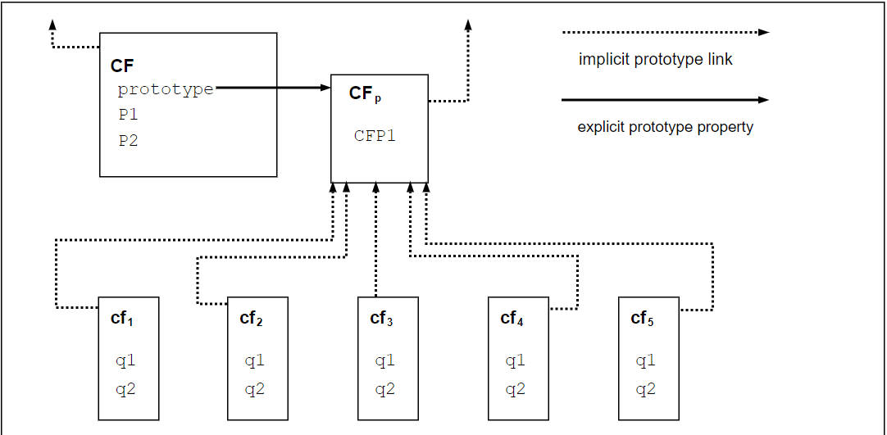

# 概述

ECMAScript 是一种面向对象的编程语言，用于在主机环境中执行计算和操作计算对象。此处定义的 ECMAScript 并非旨在实现计算自给自足;实际上，本规范中没有关于输入外部数据或输出计算结果的规定。相反，预计 ECMAScript 程序的计算环境不仅提供本规范中描述的对象和其他工具，还提供某些特定于环境的对象，这些对象的描述和行为超出了本规范的范围，除了表明它们可能提供某些可以访问的属性和可以从 ECMAScript 程序调用的某些函数。

ECMAScript 最初被设计为一种脚本语言，但作为一种通用编程语言被广泛使用。脚本语言是一种编程语言，用于操作、自定义和自动化现有系统的设施。在此类系统中，有用的功能已经通过用户界面提供，脚本语言是一种将该功能公开给程序控制的机制。这样，现有系统被称为提供对象和设施的主机环境，从而完成了脚本语言的功能。脚本语言旨在供专业和非专业程序员使用。

ECMAScript 最初被设计为一种 Web 脚本语言，它提供了一种机制来活跃浏览器中的网页，并作为基于 Web 的客户端-服务器体系结构的一部分执行服务器计算。ECMAScript 现在用于为各种主机环境提供核心脚本功能。因此，除了任何特定的主机环境之外，本文档中还指定了核心语言。

ECMAScript 的使用已经超越了简单的脚本编写，现在它被用于许多不同环境和规模的全方位编程任务。随着 ECMAScript 的使用范围不断扩大，它提供的功能和设施也随之扩展。ECMAScript 现在是一种功能齐全的通用编程语言。
## 网页脚本

Web 浏览器为客户端计算提供了一个 ECMAScript 主机环境，例如，包括表示窗口、菜单、弹出窗口、对话框、文本区域、锚点、框架、历史记录、cookie 和输入/输出的对象。此外，宿主环境提供了一种将脚本代码附加到事件的方法，例如焦点更改、页面和图像加载、卸载、错误和中止、选择、表单提交和鼠标操作。脚本代码显示在 HTML 中，显示的页面是用户界面元素以及固定和计算的文本和图像的组合。`脚本代码对用户交互是被动的，不需要主程序。`

Web 服务器为服务器端计算提供不同的主机环境，包括表示请求、客户端和文件的对象;以及锁定和共享数据的机制。通过同时使用浏览器端和服务器端脚本，可以在客户端和服务器之间分配计算，同时为基于 Web 的应用程序提供定制的用户界面。

每个支持 ECMAScript 的 Web 浏览器和服务器都提供自己的宿主环境，完成 ECMAScript 的执行环境。

## 主机和实现

为了帮助将 ECMAScript 集成到主机环境中，此规范将某些工具（例如，抽象操作）的定义全部或部分推迟到本规范之外的源。在编辑上，此规范区分了以下类型的延迟。

实施是进一步定义附件D中列举的设施或标记为实施定义或近似实施的设施的外部来源。在非正式使用中，实现是指具体的工件，例如特定的 Web 浏览器。

实现定义的设施是将其定义推迟到外部源而不进一步限定的设施。此规范不对特定行为提出任何建议，符合要求的实现可以自由选择本规范提出的约束内的任何行为。

实现近似设施是将其定义推迟到外部源，同时推荐理想行为的工具。虽然符合要求的实现可以自由选择本规范提出的约束内的任何行为，但鼓励他们努力接近理想。一些数学运算（如 Math.exp ）是近似实现的。

主机是进一步定义附件D中列出的设施的外部源，但不进一步定义其他实施定义或近似实施的设施。在非正式使用中，主机是指所有实现的集合，例如所有 Web 浏览器的集合，它们通过附件 D 以相同的方式与本规范交互。主机通常是一个外部规范，例如 WHATWG HTML （ https://html.spec.whatwg.org/）。换句话说，主机定义的设施通常在外部规范中进一步定义。

主机挂钩是由外部源全部或部分定义的抽象操作。所有主机挂钩必须列在附录 D 中。主机挂钩必须至少满足以下要求：
+ 它必须返回正常完成或抛出完成。

主机定义的设施是将其定义推迟到外部源而不进行进一步限定的设施，并列在附件 D 中。不是主机的实现也可以为主机定义的设施提供定义。

主机环境是所有主机定义的设施的特定定义选择。主机环境通常包括对象或函数，这些对象或函数允许获取输入并将输出作为全局对象的主机定义属性提供。

此规范遵循始终使用最具体术语的编辑惯例。例如，如果设施是主机定义的，则不应将其称为实现定义的设施。

主机和实现都可以通过此处定义的语言类型、规范类型、抽象操作、语法产品、内部对象和内部符号与本规范进行交互。

## 概述
以下是 ECMAScript 的非正式概述 — 并未描述该语言的所有部分。本概述不是标准的一部分。

ECMAScript 是基于对象的：基本语言和主机设施由对象提供，ECMAScript 程序是通信对象的集群。在 ECMAScript 中，对象是零个或多个属性的集合，每个属性都具有确定如何使用每个属性的属性 — 例如，当属性的 Writable 属性设置为 false 时，执行的 ECMAScript 代码为该属性分配不同值的任何尝试都将失败。属性是保存其他对象、基元值或函数的容器。基元值是以下内置类型之一的成员：Undefined, Null, Boolean, Number, BigInt, String, and Symbol;对象是内置类型 Object 的成员;函数是可调用的对象。通过属性与对象关联的函数称为方法。

ECMAScript 定义了一个内置对象的集合，这些对象完善了 ECMAScript 实体的定义。这些内置对象包括全局对象;对语言的运行时语义至关重要的对象，包括 Object 、 Function Boolean 、 Symbol 和各种 Error 对象;表示和操作数值的对象，包括 Math 、 Number 和 Date ;文本处理对象 String 和 RegExp ;对象是值的索引集合，包括 Array 九种不同类型的类型数组，其元素都具有特定的数字数据表示形式;键控集合，包括 Map 和 Set 对象;支持结构化数据的对象，包括 JSON 对象、 SharedArrayBuffer 、 ArrayBuffer 和 DataView ;支持控制抽象的对象，包括生成器函数和 Promise 对象;和反射对象，包括 Proxy 和 Reflect 。

ECMAScript 还定义了一组内置运算符。ECMAScript 运算符包括各种一元运算、乘法运算符、加法运算符、按位移位运算符、关系运算符、相等运算符、二进制位运算符、二进制逻辑运算符、赋值运算符和逗号运算符。

大型 ECMAScript 程序由模块支持，这些模块允许将程序划分为多个语句和声明序列。每个模块显式标识它使用的声明，这些声明需要由其他模块提供，以及其哪些声明可供其他模块使用。

ECMAScript 语法有意类似于 Java 语法。ECMAScript 语法被放宽，使其能够作为一种易于使用的脚本语言。例如，变量不需要声明其类型，类型也不要求与属性相关联，并且定义的函数不需要在调用它们之前以文本方式显示其声明。

## Object 对象
尽管 ECMAScript 包含类定义的语法，但 ECMAScript 对象基本上并不是基于类的，例如 C++、Smalltalk 或 Java 中的对象。相反，可以通过各种方式创建对象，包括通过文字表示法或通过构造函数创建对象，然后执行代码，通过将初始值分配给其属性来初始化全部或部分对象。每个构造函数都是一个函数，该函数具有一个名为“prototype”的属性，该属性用于实现基于原型的继承和共享属性。对象是通过使用新表达式中的构造函数创建的;例如， new Date(2009, 11) 创建一个新的 Date 对象。调用构造函数而不使用 new 会产生取决于构造函数的后果。例如， 生成当前日期和时间的字符串表示形式， Date() 而不是对象。

构造函数创建的每个对象都有一个对其构造函数的“原型”属性值的隐式引用（称为对象的原型）。此外，原型可能具有对其原型的非空隐式引用，依此类推;这称为原型链。当引用对象中的属性时，该引用是指向原型链中包含该名称属性的第一个对象中该名称的属性。换句话说，首先检查直接提到的对象是否存在这样的属性;如果该对象包含命名属性，则为引用引用的属性;如果该对象不包含 named 属性，则接下来检查该对象的原型;等等。

在基于类的面向对象语言中，通常，状态由实例承载，方法由类承载，继承仅由结构和行为承载。在 ECMAScript 中，状态和方法由对象承载，而结构、行为和状态都是继承的。

