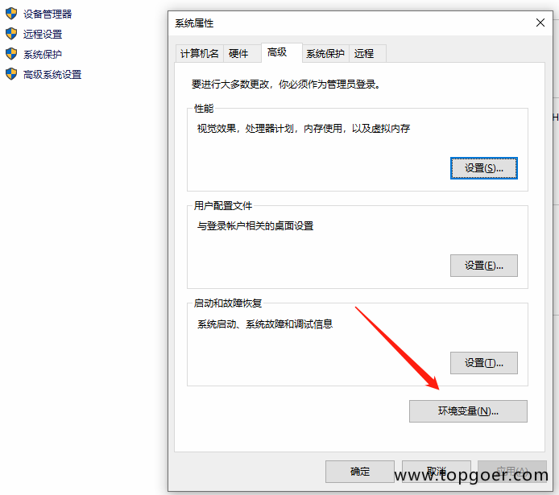
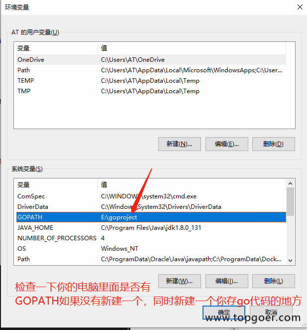
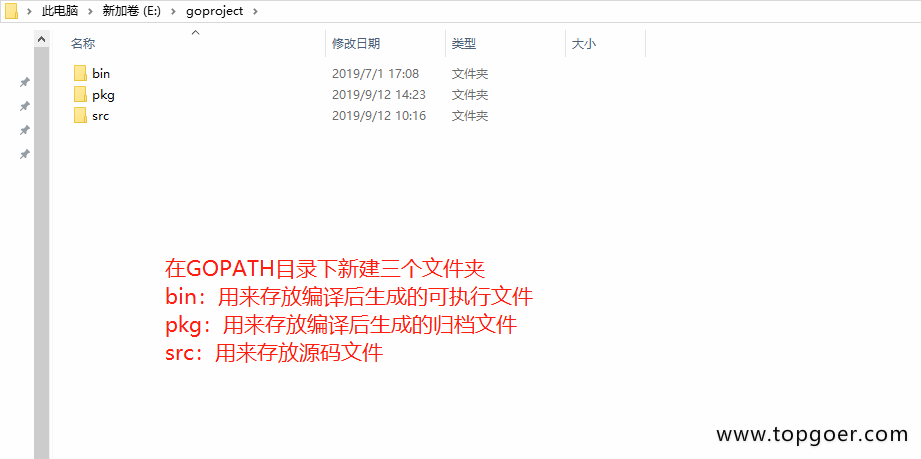
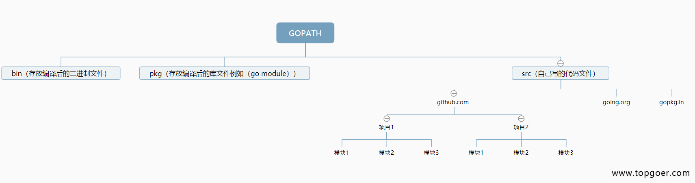

# 配置GOPATH
GOPATH是一个环境变量，用来表明你写的go项目的存放路径

GOPATH路径最好只设置一个，所有的项目代码都放到GOPATH的src目录下。

Linux和Mac平台就参照上面配置环境变量的方式将自己的工作目录添加到环境变量中即可。 Windows平台按下面的步骤将（你的安装目录，例如：D:\go）添加到环境变量：

### 我的电脑->属性->高级系统设置

配置GOPATH

检查一下你的电脑里面是否存在GOPATH并且设置值为你要存go代码的目录


同时在path里面添加go的安装目录和GOPATH目录


### go的项目目录
在进行Go语言开发的时候，我们的代码总是会保存在$GOPATH/src目录下。在工程经过go build、go install或go get等指令后，会将下载的第三方包源代码文件放在$GOPATH/src目录下， 产生的二进制可执行文件放在 $GOPATH/bin目录下，生成的中间缓存文件会被保存在 $GOPATH/pkg 下。

如果我们使用版本管理工具（Version Control System，VCS。常用如Git）来管理我们的项目代码时，我们只需要添加$GOPATH/src目录的源代码即可。bin 和 pkg 目录的内容无需版本控制。

### 适合个人开发者
我们知道源代码都是存放在GOPATH的src目录下，那我们可以按照下图来组织我们的代码。


### 目前流行的项目结构
Go语言中也是通过包来组织代码文件，我们可以引用别人的包也可以发布自己的包，但是为了防止不同包的项目名冲突，我们通常使用顶级域名来作为包名的前缀，这样就不担心项目名冲突的问题了。

因为不是每个个人开发者都拥有自己的顶级域名，所以目前流行的方式是使用个人的github用户名来区分不同的包。



举个例子：张三和李四都有一个名叫studygo的项目，那么这两个包的路径就会是：
```
import "github.com/zhangsan/studygo"
```
和
```
import "github.com/lisi/studygo"
```
以后我们从github上下载别人包的时候，如：

go get github.com/jmoiron/sqlx
那么，这个包会下载到我们本地GOPATH目录下的src/github.com/jmoiron/sqlx。

### 适合企业开发者
