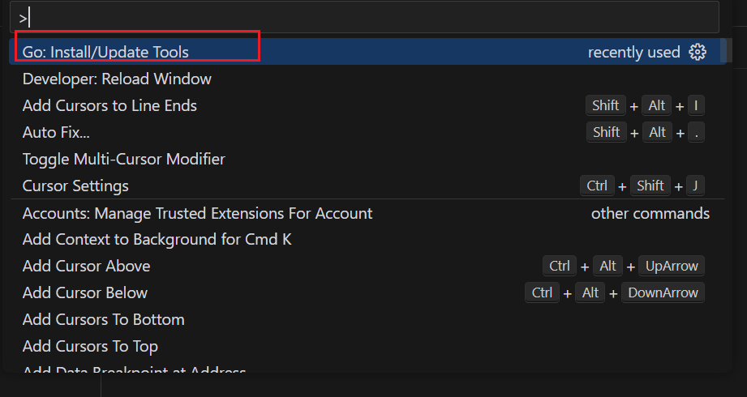
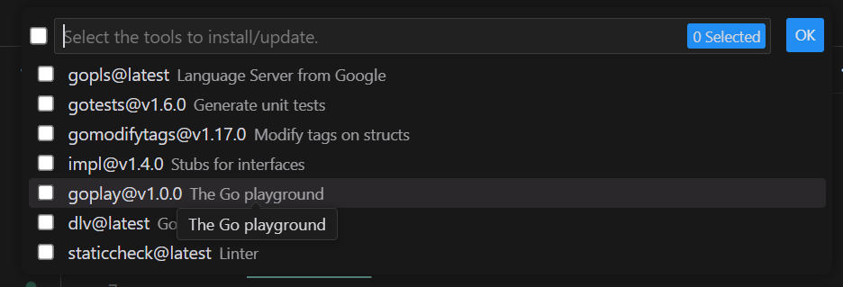

# golang学习

## 1. 准备

### 安装vscode扩展


### 安装工具
Ctrl + shift + p 打开命令面板



全选所有的工具，然后点击安装


如果所有未安装成功需要设置go代理
```
go env -w GO111MODULE=on

go env -w GOPROXY=https://goproxy.cn,direct
```
### 安装go
