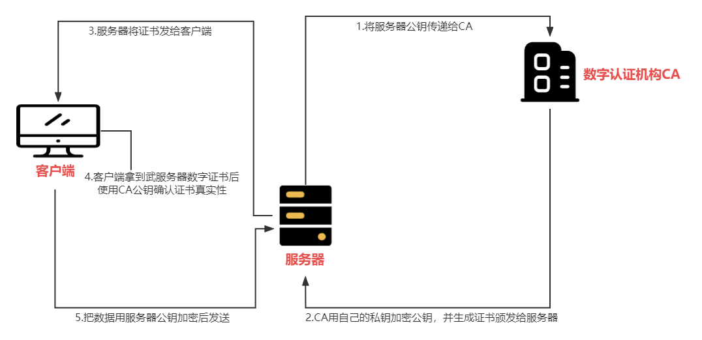
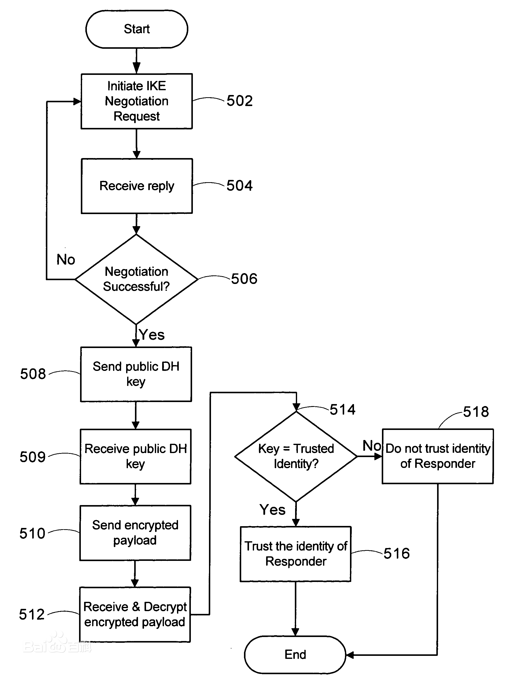

# TSL和SSL加密

## HTTPS 简介

### SSL 和 TLS

**`安全套接层 SSL（Secure Sockets Layer）`** 在 SSL 之前 HTTP 传输报文是明文，可能存在安全隐患，SSL 为此诞生。

**`传输层安全性协议 TLS（Transport Layer Security）`** 因 SSL 应用广泛，后来将标准化之后的 SSL 改名为 即传输层安全性协议。

#### 协议层级

SSL 和 TLS 位于网络模型 `HTTP网络层`和 `TCP传输层`之间

#### 作用

- 防止信息窃听、信息篡改、信息劫持
- 具备信息加密、完整性校验、身份验证功能

### HTTPS 加密

HTTPS = HTTP + TLS

| 非对称加密   | 对称加密     | 散列算法       |
| ------------ | ------------ | -------------- |
| RSA ECC DH   | AES DES RC4  | MD5 SHA        |
| 负责身份验证 | 负责信息加密 | 负责完整性校验 |

加密是研究如何安全通信的一种手段，保证在数据传输过程中的安全性。

| 风险     | 对策       | 方法                |
| -------- | ---------- | ------------------- |
| 信息窃听 | 信息加密   | AES                 |
| 密钥传递 | 密钥协商   | RSA 和 ECC          |
| 信息篡改 | 完整性验证 | 散列算法 MD5 和 RSA |
| 身份冒充 | CA 认证    | 散列算法 + RSA      |

#### 对称加密

- 对称加密是最快速、最简单的一种加密方式，加密与解密都是用的同样的密钥
- 主流的有 AES 和 DES
- `algorithm`指加密算法,如 aes-128-ecb,aes-128-cbc
- `iv`指定加密时所用向量
- 如果加密算法是 128,则对应的密钥是 16 位,加密算法是 256,对应的密钥是 32 位

##### 简单实现一个凯撒加密

| 凯撒加密 |     |     |     |
| -------- | --- | --- | --- |
| 信息     | A   | B   | C   |
| ↓        | ↓   | ↓   | ↓   |
| 密文     | D   | E   | F   |

```js
// 实现凯撒加密
let secret = 3;
function encrypt(message) {
  let buffer = Buffer.from(message);
  for (let i = 0; i < buffer.length; i++) {
    buffer[i] = buffer[i] + secret;
  }
  return buffer.toString();
}

function decrypt(message) {
  let buffer = Buffer.from(message);
  for (let i = 0; i < buffer.length; i++) {
    buffer[i] = buffer[i] - secret;
  }
  return buffer.toString();
}

let message = "abc";

let encryptMessage = encrypt(message);
console.log(encryptMessage);

let decryptMessage = decrypt(encryptMessage);
console.log(decryptMessage);

console.log(message === decryptMessage);
```

##### AES

```js
// 使用nodejs标准库加密
const crypto = require("crypto");

function encrypt(data, key, iv) {
  const cipher = crypto.createCipheriv("aes-128-cbc", key, iv);
  cipher.update(data);
  return cipher.final("hex");
}

function decrypt(data, key, iv) {
  const cipher = crypto.createDecipheriv("aes-128-cbc", key, iv);
  cipher.update(data, "hex");
  return cipher.final("utf8");
}

let key = "1234567890123456"; // 使用128加密算法，密钥应该是16位
let iv = "1234567890123456";
let data = "hello";

let encryptData = encrypt(data, key, iv);
console.log(encryptData);

let decryptData = decrypt(encryptData, key, iv);
console.log(decryptData);
```

#### 非对称加密

解决互联网上没法安全交换密钥

##### 单向函数

- 单向函数算起来非常容易,但逆向求解却很难
- 整数分解,将正整数写成几个约数的乘积

##### 示例代码

```js
const {
  generateKeyPairSync,
  privateEncrypt,
  publicDecrypt,
} = require("crypto");

const rsa = generateKeyPairSync("rsa", {
  modulusLength: 1024,
  publicKeyEncoding: {
    type: "spki",
    format: "pem", // base64格式的私钥
  },
  privateKeyEncoding: {
    type: "pkcs8",
    format: "pem",
    cipher: "aes-256-cbc",
    passphrase: "codingj",
  },
});

let message = "hello world";

const encryptMessage = privateEncrypt(
  {
    key: rsa.privateKey,
    passphrase: "codingj",
  },
  Buffer.from(message, "utf8")
);

console.log(encryptMessage);

const decryptMessage = publicDecrypt(rsa.publicKey, encryptMessage);
console.log(decryptMessage.toString());
```

#### hash 加密

- 不同的输入有不同的输出
- 不能从 hash 反推输入
- 长度固定
- hash 没有密钥的概念,只是计算散列值用

```JS
const { createHash, createHmac } = require("crypto");

let message = "hello world";

let md5Hash = createHash("md5").update(message).digest("hex");
console.log(md5Hash);
console.log(md5Hash.length);

let salt = "coding";
let shaHash = createHmac("sha256", salt).update(message).digest("hex");
console.log(shaHash);
console.log(shaHash.length);
```

#### 数字签名

- 用于验证数据的完整性和可靠性
- 数字前面的基本原理是用私钥去签名，公钥去验证签名。
- 加密通信是公钥加密，私钥解密
- 数字签名是私钥加密，公钥解密。

##### 数字签名流程

- 采用散列算法对原始报文进行运算，得到一个固定长度的数字串，称为报文摘要(Message Digest)，不同的报文所得到的报文摘要各异，但对相同的报文它的报文摘要却是惟一的。在数学上保证，只要改动报文中任何一位，重新计算出的报文摘要值就会与原先的值不相符，这样就保证了报文的不可更改性。
- 发送方用目己的私有密钥对摘要进行加密来形成数字签名。
- 这个数字签名将作为报文的附件和报文一起发送给接收方。
- 接收方首先对接收到的原始报文用同样的算法计算出新的报文摘要，再用发送方的公开密钥对报文附件的数字签名进行解密，比较两个报文摘要，如果值相同，接收方就能确认该数字签名是发送方的，否则就认为收到的报文是伪造的或者中途被篡改。

##### 原理

因为数字签名是通过私钥加密，所以当接收方使用公钥对文件进行加密，若跟私钥加密结果一致，说明签名通过

```js
const { generateKeyPairSync, createSign, createVerify } = require("crypto");

// 生成一对密钥，一个是公钥一个是私钥
const rsa = generateKeyPairSync("rsa", {
  modulusLength: 1024,
  publicKeyEncoding: {
    type: "spki",
    format: "pem", //base64格式的密钥
  },
  privateKeyEncoding: {
    type: "pkcs8",
    format: "pem",
    cipher: "aes-256-cbc",
    passphrase: "passphrase",
  },
});

console.log(rsa);
let file = "这是一个即将加密的文件";
// 创建签名对象
const signObj = createSign("RSA-SHA256");
signObj.update(file);
// 用RSA私钥签名,生成16进制字符串
const sign = signObj.sign(
  {
    key: rsa.privateKey,
    format: "pem",
    passphrase: "passphrase",
  },
  "hex"
);

console.log(sign);

// 创建签名验证对象
const verifyObj = createVerify("RSA-SHA256");
// 放入文件内容
verifyObj.update(file);
// 验证签名是否合法
const isvalid = verifyObj.verify(rsa.publicKey, sign, "hex");
console.log(isvalid); // true 验证通过
```

#### 数字证书

- 数字证书是一个可信的第三方发出的，用来证明所有人身份以及所有人拥有某个公钥的电子文件
- 证书目的是证明拿到的公钥是真的

  

##### 实现数字证书原理

```js
// 实现数字证书的原理

const {
  generateKeyPairSync,
  createSign,
  createVerify,
  createHash,
} = require("crypto");

// 密码
const passphrase = "passphrase";

const serverRsa = generateKeyPairSync("rsa", {
  modulusLength: 1024,
  publicKeyEncoding: {
    type: "spki",
    format: "pem", //base64格式密钥
  },
  privateKeyEncoding: {
    type: "pkcs8",
    format: "pem",
    cipher: "aes-256-cbc",
    passphrase, // 私钥密码
  },
});
const caRSA = generateKeyPairSync("rsa", {
  modulusLength: 1024,
  publicKeyEncoding: {
    type: "spki",
    format: "pem", //base64格式密钥
  },
  privateKeyEncoding: {
    type: "pkcs8",
    format: "pem",
    cipher: "aes-256-cbc",
    passphrase, // 私钥密码
  },
});

// 服务器信息
const info = {
  domain: "http://127.0.0.1:8080",
  publicKey: serverRsa.publicKey,
};

// 将服务器信息发送给CA机构并请求颁发证书
// 实现的时候签名的并不是info,而是它的hash,性能很差,一般不能计算大量数据

const hash = createHash("sha256").update(JSON.stringify(info)).digest("hex");

const sign = getSign(hash, caRSA.privateKey, passphrase);

const cert = {
  info,
  sign, // CA的签名
}; // 这就是证书，客户端会先验证证书，用CA的公钥验证证书的合法性

const valid = verifySign(hash, sign, caRSA.publicKey);
console.log("浏览器验证CA的签名", valid);

// 如果验证通过浏览器可以拿到服务器的公钥

const serverPublicKey = cert.info.publicKey;

// 拿到服务器公钥之后,向服务器发送数据时,使用服务器的公钥进行加密就好了

function getSign(content, privateKey, passphrase) {
  const signObj = createSign("RSA-SHA256");
  signObj.update(content);
  return signObj.sign({
    key: privateKey,
    format: "pem",
    passphrase,
  });
}

function verifySign(content, sign, publicKey) {
  const verifyObj = createVerify("RSA-SHA256");
  verifyObj.update(content);
  return verifyObj.verify(publicKey, sign, "hex");
}
```

#### Diffie-Hellman 算法

Diffie-Hellman 算法是一种密钥交换协议，它可以在双方不泄露密钥的的情况下协商一个密钥出来



##### 原理

```js
// 公开数据，由A和B协商的结果
const N = 23;
const P = 5;

// secretA 和 secretB 指自己的密钥,不向外部公开
const secretA = 9;
const secretB = 13;

// A B是根据N P计算出的数据.会分别发送给对方
const A = Math.pow(P, secretA) % N;
const B = Math.pow(P, secretB) % N;

// 当 A B都接受到数据时候,计算出公共密钥
const commonA = Math.pow(B, secretA) % N;
const commonB = Math.pow(A, secretB) % N;

console.log("认证成功？", commonA === commonB);
```

##### 使用

```js
const { createDiffieHellman } = require("crypto");
const { generate } = require("escodegen");

// 客户端

const client = createDiffieHellman(521);
const clientKeys = client.generateKeys();
const generator = client.getGenerator();
const prime = client.getPrime();

// 服务器端

const server = createDiffieHellman(prime, generator);
const serverKeys = server.generateKeys();

// 交换临时密钥Key

const clientSecret = client.computeSecret(serverKeys).toString("hex");
const serverSecret = server.computeSecret(clientKeys).toString("hex");

console.log(clientSecret);
console.log(serverSecret);

console.log("协商后的密钥是否一致", clientSecret === serverSecret);

// 改协商密钥就是用来传递信息的加密依据
```
