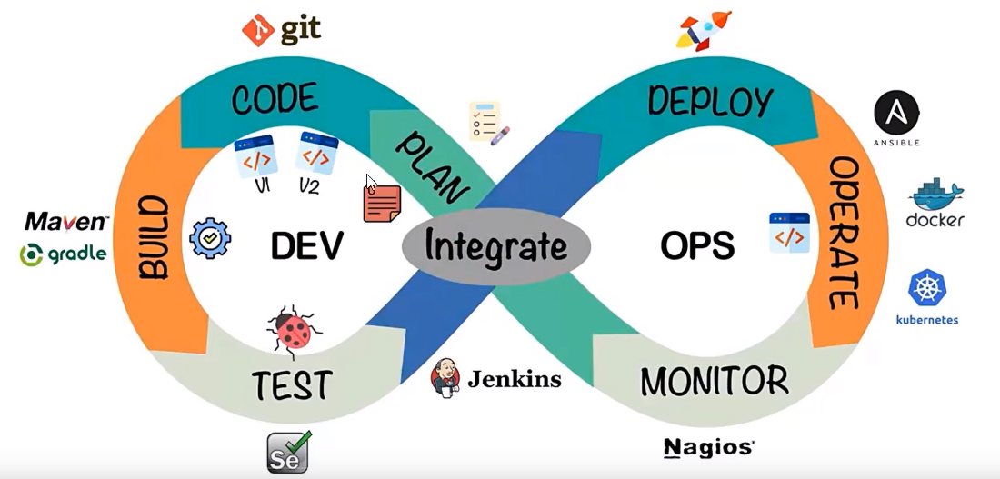

# DevOps开发的生命周期
## 概述
DevOps开发的生命周期，通常称为 DevOps 生命周期，是一种将软件开发（Dev）与信息技术运维（Ops）紧密结合的实践框架，旨在通过自动化、协作、持续改进和快速反馈循环来提升软件交付的质量、速度与稳定性。

## 1. 规划与需求分析
### 需求收集
与业务方、利益相关者沟通，明确软件的功能需求、非功能需求及业务目标。
### 需求管理
记录、跟踪、评估和优先排序需求，确保其清晰、完整且可度量。
### 项目规划
制定项目路线图、时间表、资源分配和风险缓解策略。
## 2. 设计与开发
### 架构设计
基于需求和业务场景设计系统架构，考虑可扩展性、安全性、性能等因素。
### 编码
遵循编程规范、设计原则和最佳实践编写代码，实现功能模块。
### 版本控制
使用 Git 等工具进行源代码管理，保证代码版本的追溯性和协作性。
## 3. 持续集成 (CI)
### 代码提交
开发者频繁提交代码变更至共享代码库。
### 自动构建
每次代码提交触发自动编译、链接和打包，生成可部署的工件。
### 单元测试
执行自动化单元测试以验证代码模块的正确性。
### 静态代码分析
检查代码质量、风格一致性、潜在漏洞等。
### 合并请求/代码审查
通过 pull request 或 merge request 进行同行评审，确保代码质量和遵循团队标准。
### 构建状态反馈
及时通知团队构建结果，快速识别并修复问题。
## 4. 持续交付 (CD)
### 自动化部署
通过脚本或工具（如 Ansible、Terraform、Jenkins、GitLab CI/CD 等）### 自动将构建产物部署到不同环境（如开发、测试、预生产、生产）。
### 环境管理
采用基础设施即代码（IaC）方法管理环境配置，确保一致性。
### 集成测试
在部署后的环境中执行集成测试、接口测试、端到端测试等。
### 配置管理
自动化应用配置、数据库迁移、密钥注入等操作。
### 审批与金丝雀发布
实施权限控制和审批流程，支持蓝绿部署、金丝雀发布等策略以降低风险。
## 5. 持续部署 (CD)（可选）
### 自动发布
在满足特定条件（如所有测试通过、业务批准）时，自动将新版本推送到生产环境。
### 实时监控
设置实时监控和警报系统（如 Prometheus、Grafana、ELK Stack 等）以监控### 应用性能、资源利用率、错误率等指标。
### 故障恢复
具备快速回滚机制，一旦发现问题能迅速恢复到上一稳定版本。
## 6. 持续监控与反馈
### 应用性能监控
持续收集和分析应用性能数据，确保系统健康运行。
### 日志管理
集中收集、分析和搜索日志，用于故障排查和趋势分析。
### 用户反馈
收集用户反馈、使用情况数据，驱动产品优化和新需求识别。
### 度量与报告
跟踪关键绩效指标（KPIs），生成项目进度报告、运维状态报告等。
### 持续学习与改进
定期回顾项目、运维实践，运用精益、敏捷、看板等方法持续改进流程。