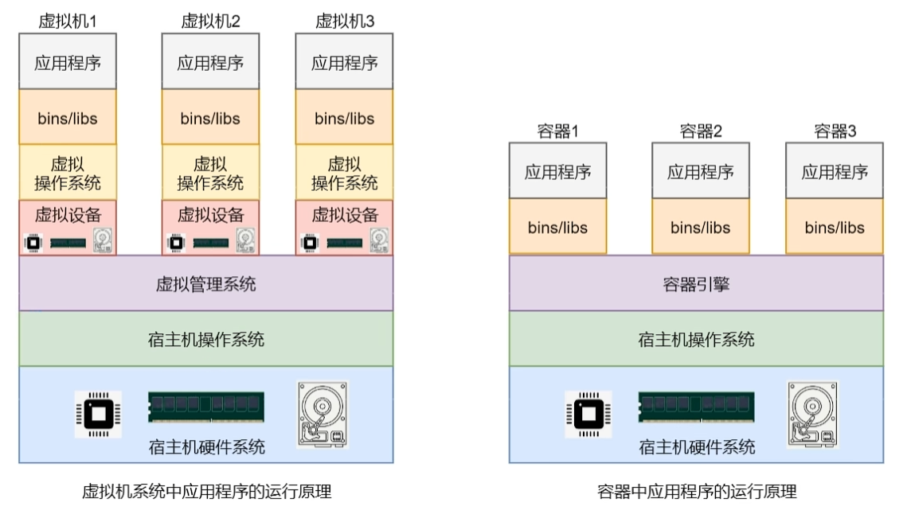

# 概述

Docker 是一个开源的应用容器引擎，基于 Go 语言实现，利用 Go 语言编写，用于开发、打包、发布应用。

## 前言
### 在Docker诞生前，开发团队面临的一些问题？
+ 开发、测试、运维不和谐的原因是什么？（环境不同）
+ 运维架构师的抱怨点在哪里？（运维成本高，不能一键部署）
+ 集群搭建所面临的问题是什么？（集群管理成本高，虚拟机启动不能太多）
### 什么是devOps
+ DevOps 是一种思想，是一种管理模式。用于促进开发测试运维之间的沟通协作。

### Docker的用途
+ Dokcer可以将应用和环境打包成镜像，实现'一处运行，处处可运行'。

### Docker与虚拟机的区别

虚拟机中存在独立的虚拟硬件和虚拟操作系统，但容器是直接共享宿主机的操作系统与硬件。

### windows系统的虚拟化

#### Hypervisor

+ Hypervisor 是介于操作系统和硬件系统之间，用于实现多个虚拟机共享宿主机的硬件系统
#### Hyper-V
+ 微软提供的商业化Hypervisor,它运行在windows系统上。类比Linux系统上的KVM。

#### windows10上的VMWare不兼容问题

从15.5.5版本开始，其对VMM虚拟机技术进行了重构，由原来需要直接调用CPU的虚拟化功能，改变为了通过调用Win10系统的WHP(Windows管理程序平台)的API来运行。解决了VMware工作站与Hyper-V的不兼容问题。

### Docker的系统架构
