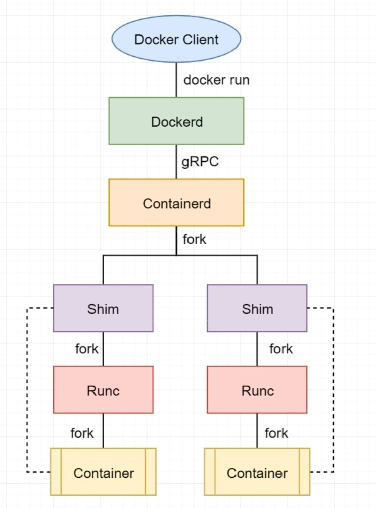

# Docker引擎

## 引擎架构详解
Docker引擎是用来运行和管理容器的核心软件，其现代架构由四部分构成：Docker Client、Dockerd、Containerd和Runc。
### Docker Client
Docker Client是Docker引擎的命令行客户端CLI工具，通过Docker Client，用户可以轻松地使用Docker引擎提供的各种功能。

### Dockerd
Dockerd即Docker Daemon，在现代Dockerd中的主要包含功能有镜像构建、镜像管理、REST API、核心网络及编排等。其通过gRPC协议与Containerd进行通信。可以理解为docker server。
### Containerd
Containerd,即Container Daemon,该项目主要功能是管理容器的生命周期。不过，其本身不会创建容器，而是调用Runc来创建容器。Containerd通过gRPC协议与Dockerd进行通信。
### Runc
+ Runc即Run Container,是OCI（开放容器倡议基金会）的实现，Runc项目的目标之一就是与OCI的规范保持一致。所以，Runc所在的层也被称为OCI层，这使得Docker Deamoon中不用再包含任何容器运行时的代码了，简化了Docker Deamon.
+ Runc只有一个作用,就是创建容器。其本质是一个独立的容器运行时CLI工具。其再fork出一个容器子进程后会启动该容器进程。在容器进程启动完毕后，Runc会自动退出。

### Shim
+ Shim是Docker引擎与容器运行时之间的桥梁，它使容器与Docker Deamon解耦，使得DOkcer Deamon的维护与升级不会影响到运行中的容器。每次创建容器时，Container会先fork出shim进程，再由Shim进程fork出Runc进行，当Runc自动退出之前，会先将新容器进程的父进程指定给相应的Shim进程。
+ 除了作为容器的父进程之外，Shim还具备两个重要的功能。一是保持所有STDIN与STDOUT流的开启状态，从而使得Docker Deamon重启时，容器不会因为pipe得关闭而终止。二是将容器的退出状态反馈给Dokcer Deamon.