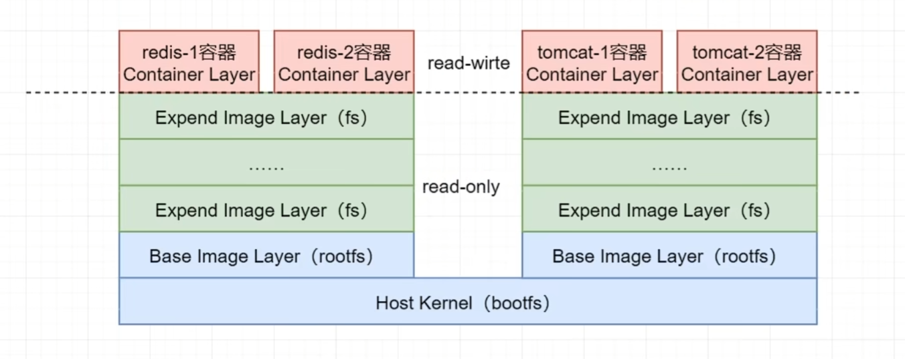
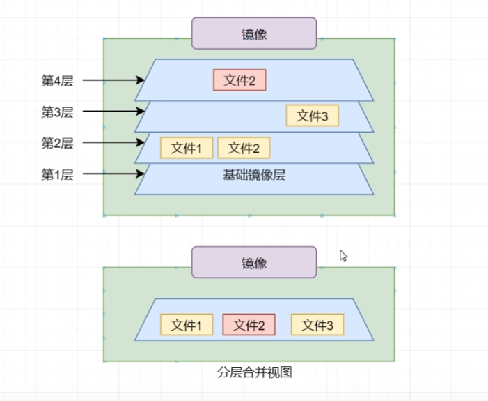
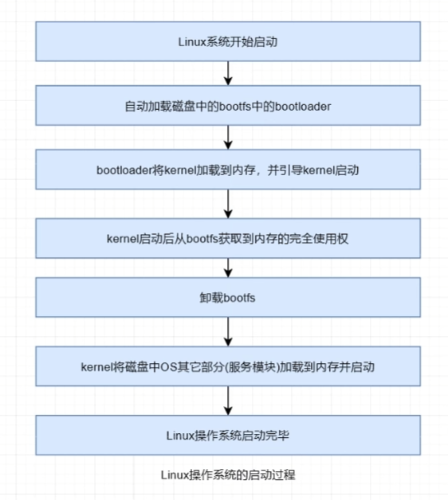

# 镜像

## 镜像简介
镜像是一种轻量级、可执行的独立软件包，也可以说是一个精简的操作系统，镜像中包含应用软件及应用软件的运行环境。具体来说镜像包含运行某个软件所需的所有内容，包括代码、库、环境变量和配置文件等。容器设计的初衷就是快速、小巧，所以镜像通常都比较小，镜像中不包含内核，其共享宿主机的内核。镜像中值包含简单的shell或没有shell.

### 镜像仓库的分类
镜像重心存储着大量的镜像仓库Image Repository,每个镜像仓库中包含着大量相关镜像。根据这些镜像发布者的不同，形成了四类不同的镜像仓库。

#### Docker Official Image
DOcker官方镜像仓库，该类仓库中的镜像由Docker官方构建发布，代码质量较高且安全，有较完善的文档。该类仓库中的镜像会及时更新。一般常用的系统、工具软件、中间件都有相应的官方镜像仓库。如：zookeeper、mysql、redis等。
#### Veried Publisher
已验证发布者仓库。该仓库中的镜像由非官方的第三方发布。但该第三方由Docker公司审核认证过的，一般为大型企业、团体或组织’审核通过后，Docker公司会向其颁发`Veried Publisher`标识，这种仓库中的镜像质量还是由保证的。
除了官方镜像仓库，其他都是非官方镜像仓库，非官方镜像仓库名称一般由发布者用户名与软件名称两部分构成。形式是
```
<用户名>/<软件名称>
```

#### Sponsored OSS
由Docker公司赞助开发的镜像仓库，该类仓库中的镜像也由非Docker官方的第三方发布，但该镜像的开发是由Docker公司赞助的。该类的第三方一般为个人、团队或者组织。这种仓库中的镜像质量也是有保证的。

#### 无认证仓库
没有以上任何标识。这种仓库中的镜像良莠不齐，质量上无法保证，在使用时需谨慎。

### 第三方镜像中心
镜像中心默认使用的都是Docker官方的Docker Hub。不过，镜像中心是可配置的，可以使用指定的第三方镜像中心。对于第三方的镜像中心仓库名称`repository`由三部分构成：
```
<domain-name>/<user-name>/<soft-name>
```

### 镜像定位
对于任何镜像，都可以通过`{{repository}}-{{tag}}`进行唯一定位。其中`tag`一般称为镜像的版本号。`tag`中有一个比较特殊的版本，latest。如果不指定版本，默认tag为latest。字面意思是最新版，一般来说也是最新版，但是并不能保证一定是最新版。

## 自动化镜像
AUTOMATED，使用docker hub链接一个包含dockerFile文件的叫做自动化镜像。

## 镜像分层
### 什么是分层
Docker 镜像是由一些松耦合的只读镜像层组成，DOcker Deamon负责堆叠这些镜像层，并将它们关联为一个统一的整体，即对外表现出的是一个独立的对象。
通过Docker pull命令拉取指定的镜像时，每个pull complete结尾行就代表下载完毕了一个镜像层。
列如，下面的redis:latest镜像就包含了8个镜像分层。
```
# docker的pull redis的分层
13808c22b207: Pull complete
6900ab66c9ff: Pull complete
d707ec7ebe0f: Pull complete
031016405bfb: Pull complete
84b54dfd90f6: Pull complete
6d2bba2ab923: Pull complete
4f4fb700ef54: Pull complete
09073cda9bdf: Pull complete
```
### 为什么分层

采用这种分层结构的优势很多，例如每个分层都是只读的，所有对分层的修改都是以新分层的形式出现，并不会破坏原分层内容；再列如，每个分层只记录变更内容，所以有利于节省空间。

不过，分层结构的最大好处是在不同镜像间的`资源共享`,即不同的镜像对相同下层镜像的复用。对于docker pull命令，其在拉取之前会先获取到其要拉取镜像的所有imageID，然后在本地查找是否存在这些分层，如果存在，则不再进行拉取，而是共享本地分层，大大的节省了网络带宽和存储空间，提升了拉取效率。
### 镜像层构成
每个镜像层由两部分构成：镜像文件系统与镜像json文件。这两部分具有相同的ImageID。
镜像文件系统就是对镜像占有磁盘空间进行管理的文件系统，拥有该镜像所有镜像层的数据内容。而镜像json文件则是用于描述镜像相关属性的集合。通过docker inspect命令可以只管看到。
### 镜像FS构成

一个docker镜像的文件系统FS由多层只读的镜像层组成，每层都完成了特定的功能。而这些只读镜像层根据其位置与功能的不同可以分为两类：基础镜像层与扩展镜像层.
#### 基础镜像层
所有镜像的最下层都具有一个可以看得到的基础镜像层Base Image,基础镜像层的文件系统称为根文件系统rootfs.而rootfs则是建立在linux系统中看不到的引导文件系统bootfs之上.
#### 扩展镜像层
扩展镜像层之上的镜像层称为扩展镜像层.顾名思义,其是对基础镜像层的功能扩展.在Dokcerfile中,每条指令都是用于完成某项特定功能的,而每条指令都会生成一个扩展镜像层.
#### 容器层
一旦镜像运行了起来就形成了容器,而容器就是一个运行中的linux系统,其他是具有文件系统的.容器的这个文件系统是在docker镜像最外层之上增加了一个可读写的容器层,对文件的任何改都只存在于容器层.因此任何对容器的操作都不会影响到镜像本身.
容器层如果需要修改某个文件,系统会从容器层开始向下,一层层的查找该文件.,直到查到为止.任何对文件的操作都会记录在容器层.列如,要修改某文件,容器层会首先把在镜像层找到的文件copy到容器层,然后再进行修改.删除文件也只会将存在于容器层中的文件副本删除.

可以看出.docker容器就是一个叠加后的文件系统,而这个容器层称为Union File System.联合文件系统.


##### linux操作系统的启动过程


相当于docker容器的bootfs是启动在linux kernel之上的。

### 镜像摘要

每一个镜像都由一个长度为64位的16进制字符串作为摘要。即Digest.它是Content Hash（内容散列）。只要镜像内容发生了改变，其内从散列一定就会发生变化。也就是说，一个镜像创建完毕，它的digest就不会改变了，因为digest是只读的。
Docker默认采用的Hash算法是SHA256.即Hash值是一个长度为256位的二进制值。Docker使用16进制表示。即变为了成都为64位的字符串。

查询摘要
```shell
# 查看redis的摘要
docker images redis --digests 
```
#### 摘要作用
摘要的作用主要是区分相同的镜像名和tag的不同镜像。
