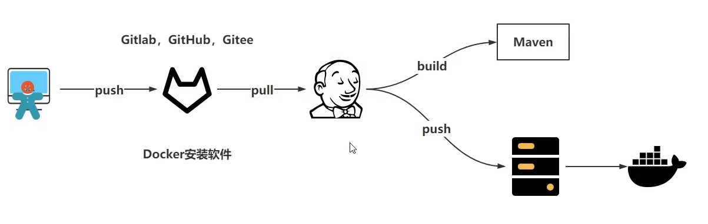

## 起源与发展
Jenkins 起源于 Hudson，最初由 Sun Microsystems 的 Kohsuke Kawaguchi 开发的一款持续集成工具。随着Oracle收购Sun Microsystems以及后续的社区分歧，Kohsuke Kawaguchi于2011年 fork 出了 Jenkins 项目，并迅速获得了广泛的社区支持和快速发展。如今，Jenkins 已成为开源 CI/CD 领域的事实标准之一。

## 核心特性与功能
### 持续集成（CI）
自动构建与验证：每当有新的代码提交或拉取请求时，Jenkins 可以自动触发构建、编译、单元测试、静态代码分析等一系列任务，确保新代码能够顺利集成且没有引入回归问题。早期发现问题有助于减少后期修复成本，提升软件质量。
### 持续交付（CD）
自动化部署：在 CI 的基础上，Jenkins 支持持续交付流程，即在验证无误后自动将软件部署到不同环境中（如测试环境、预生产环境、生产环境）。这包括打包、发布、配置管理、环境准备等工作，使得新功能或更新能够快速、安全地到达用户手中。
### 插件生态系统
丰富扩展：Jenkins 的强大之处在于其庞大的插件库，提供了超过1000个插件，覆盖了几乎所有的主流开发语言、版本控制系统（如 Git、SVN）、构建工具（如 Maven、Gradle）、测试框架、容器平台（如 Docker、Kubernetes）、云服务商接口等。这些插件极大地扩展了 Jenkins 的功能，使其能够适应各种复杂的软件项目需求和工作流。
灵活的配置与工作流
### 任务定义与管理
用户可通过 Jenkins 的 web 界面轻松创建、配置和管理任务（称为“Job”或“Pipeline”）。支持定义构建触发器（如定时、代码提交、外部事件等）、构建参数、构建步骤、依赖关系、失败处理策略等。 Jenkins 还支持使用 Groovy 编写的 Jenkinsfile 实现 Pipeline-as-Code，以代码形式管理构建流程，增强版本控制和协作能力。
可视化与监控
### 实时反馈与报表
Jenkins 提供详细的构建日志、实时构建状态、测试结果统计、代码覆盖率报告等信息，便于开发人员快速定位问题。此外，还支持自定义仪表板、电子邮件通知、IRC/Slack 等第三方工具集成，确保团队成员及时获取构建状态更新。

### 分布式构建与负载均衡
enkins 支持分布式架构，允许在多台节点上并行执行任务，提高构建效率，同时通过负载均衡机制保证资源的有效利用。这对于大型项目或需频繁构建的场景尤为实用。

综上所述，Jenkins 作为一款强大的开源 CI/CD 工具，凭借其丰富的功能、高度的可扩展性以及广泛的社区支持，为软件开发团队提供了从代码集成、测试、到部署的全生命周期自动化解决方案，有效提升了软件开发的质量、速度与效率。