# React设计原理

## React中的对象

### element对象
_jsxs方法就是来生成element对象的，它执行的结果才是element对象

element对象是对UI的描述

https://babeljs.io/

```js
/*#__PURE__*/ 这个注释可以帮助webpack做tree shaking
function App() {
  return /*#__PURE__*/_jsxs("div", {
    id: "div",
    class: "div",
    children: [/*#__PURE__*/_jsx("span", {}), /*#__PURE__*/_jsx("p", {
      id: "p"
    })]
  });
}
```
类型声明文件
```js
export interface ReactElementType {
    // 元素类型
    $$typeof: symbol | number;

    type: ElementType;
    // for循环中的key，不加默认用index代替
    key: Key;

    // 组件的props
    props: Props;

    // 组件ref
    ref: Ref;

    // 我们自己的特殊标记
    __mark: string;
}

```

### fiber对象
fiber对象是对react执行过程中元素状态的描述，打上一些标记等等
```js
export class FiberNode {
    // 元素类型，函数式组件就是函数本身
    type: any;   // div span li ul

    // 组件对象类型
    tag: WorkTag;

    // 组件初始props
    pendingProps: Props;
    key: Key;

    // 真实dom
    stateNode: any;
    ref: Ref;

    return: FiberNode | null;
    sibling: FiberNode | null;
    child: FiberNode | null;
    index: number;

    // 更新后的props状态
    memoizedProps: Props | null;
    memoizedState: any;

    // 连体婴儿  双缓存机制
    alternate: FiberNode | null;    

    // 副作用标记
    flags: Flags;
    subtreeFlags: Flags;
    updateQueue: unknown;
    constructor(tag: WorkTag, pendingProps: Props, key: Key) {
        // 实例
        this.tag = tag;
        this.key = key;
        // HostComponent <div> div DOM
        this.stateNode = null;
        // FunctionComponent () => {}
        this.type = null;

        // 构成树状结构
        this.return = null;
        this.sibling = null;
        this.child = null;
        this.index = 0;

        this.ref = null;

        // 作为工作单元
        this.pendingProps = pendingProps;
        this.memoizedProps = null;
        this.memoizedState = null;
        this.updateQueue = null;

        this.alternate = null;

        // 副作用, 更新元素的标记
        this.flags = NoFlags;
        this.subtreeFlags = NoFlags;
    }
}
```

### WorkTag

worktag是对元素类型的进一步抽象
```js
export type WorkTag =
    | typeof FunctionComponent
    | typeof HostRoot
    | typeof HostComponent
    | typeof HostText;

export const FunctionComponent = 0;
export const HostRoot = 3;   // hsotroot代表生成的中间空节点

export const HostComponent = 5;   // 原生节点  div span等
// <div>123</div>
export const HostText = 6;
```

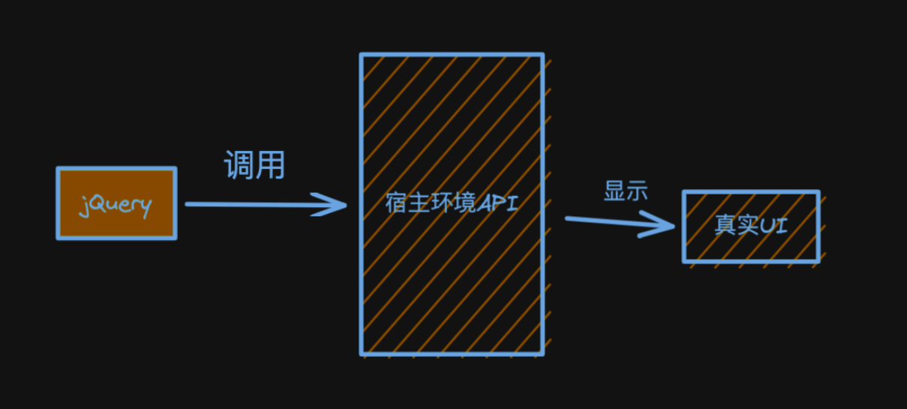
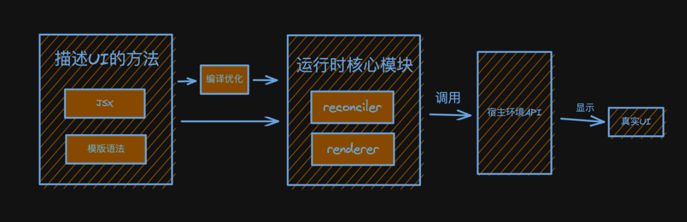
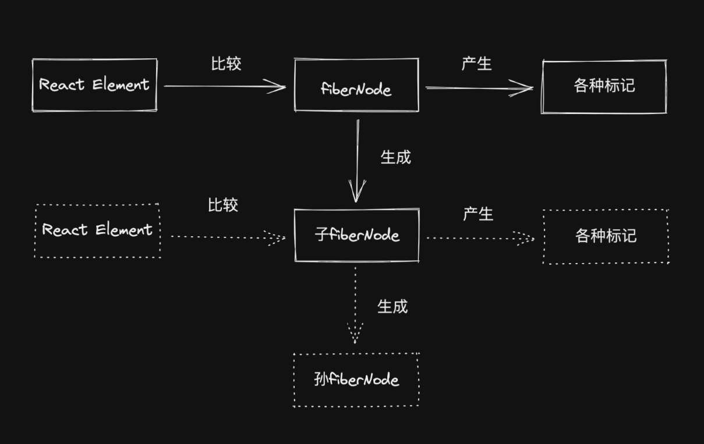

## 断点调试-挂载流程 （三大流程）
### 1. 创建初始WIP
调用顺序
```js
ReactDom.createRoot(root).render(App)
```
createRoot方法
```js
// container是 根div id=root
export function createRoot(container: Container) {
    // container div root
    const root = createContainer(container);
    return {
        render(element: ReactElementType) {
            updateContainer(element, root);
        }
    };
}
```
createContainer方法
```js
export function createContainer(container: Container) {
        // 凭空创建的， 是dom id=app的子节点
        const hostRootFiber = new FiberNode(HostRoot, {}, null);

        // container是dom id = app
        // 给容器和hostRootFiber之间建立关联关系
        const root = new FiberRootNode(container, hostRootFiber);
        hostRootFiber.updateQueue = createUpdateQueue();

        // 这是 fiberRootNode
        return root;
}
```
newFiberNode
创建fiber实例
```js
export class FiberNode {
    // 元素类型，函数式组件就是函数本身
    type: any;

    // 组件对象类型
    tag: WorkTag;

    // 组件初始props
    pendingProps: Props;
    key: Key;

    // 真实dom
    stateNode: any;
    ref: Ref;

    return: FiberNode | null;
    sibling: FiberNode | null;
    child: FiberNode | null;
    index: number;

    // 更新后的props状态
    memoizedProps: Props | null;
    memoizedState: any;

    // 连体婴儿
    alternate: FiberNode | null;

    // 副作用标记
    flags: Flags;
    subtreeFlags: Flags;
    updateQueue: unknown;
    constructor(tag: WorkTag, pendingProps: Props, key: Key) {
        // 实例
        this.tag = tag;
        this.key = key;
        // HostComponent <div> div DOM
        this.stateNode = null;
        // FunctionComponent () => {}
        this.type = null;

        // 构成树状结构
        this.return = null;
        this.sibling = null;
        this.child = null;
        this.index = 0;

        this.ref = null;

        // 作为工作单元
        this.pendingProps = pendingProps;
        this.memoizedProps = null;
        this.memoizedState = null;
        this.updateQueue = null;

        this.alternate = null;

        // 副作用, 更新元素的标记
        this.flags = NoFlags;
        this.subtreeFlags = NoFlags;
    }
}
```
WorkTag
```js
export type WorkTag =
    | typeof FunctionComponent
    | typeof HostRoot
    | typeof HostComponent
    | typeof HostText;

export const FunctionComponent = 0;   // 函数式组件
export const HostRoot = 3;   // div span 等

export const HostComponent = 5;  // class类组件
// <div>123</div>
export const HostText = 6;   // 文本节点
```
New FiberRootNode
```js
export class FiberRootNode {
    container: Container;
    current: FiberNode;
    finishedWork: FiberNode | null;
    constructor(container: Container, hostRootFiber: FiberNode) {
        this.container = container;
        this.current = hostRootFiber;
        hostRootFiber.stateNode = this;
        this.finishedWork = null;
    }
}
```
实际上形成这种关系


接下来进入，render方法
```js
export function createRoot(container: Container) {
        // root是 fiberRootNode
        const root = createContainer(container);
        
        return {
                render(element: ReactElementType) {
                        updateContainer(element, root);
                }
        };
}
```
进入updateContainer
```js
export function updateContainer(
    element: ReactElementType | null,  // App组件的element
    root: FiberRootNode
) {
    const hostRootFiber = root.current;
    
    //element App
    const update = createUpdate<ReactElementType | null>(element);

    // 给update赋值
    enqueueUpdate(
        hostRootFiber.updateQueue as UpdateQueue<ReactElementType | null>,
        update
    );
    
    scheduleUpdateOnFiber(hostRootFiber);
    return element;
}
```

createUpdate
```js
export const createUpdate = <State>(action: Action<State>): Update<State> => {
    return {
        action
    };
};
```
enqueueUpdate
```js
export const enqueueUpdate = <State>(
    updateQueue: UpdateQueue<State>,
    update: Update<State>
) => {
    updateQueue.shared.pending = update;
};
```

此时内存中的状态
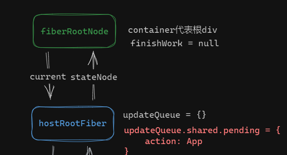

scheduleUpdateOnFiber
```js
export function scheduleUpdateOnFiber(fiber: FiberNode) {
        // TODO 调度功能
        // fiberRootNode
        
        // 获取根节点
        const root = markUpdateFromFiberToRoot(fiber);
        renderRoot(root);
}
```

scheduleUpdateOnFiber（hostRootFiber）开始渲染，
调用markUpdateFromFiberToRoot 递归获取根节点，
```js
// 向上寻找顶层节点
function markUpdateFromFiberToRoot(fiber: FiberNode) {
    let node = fiber;
    let parent = node.return;
    while (parent !== null) {
        node = parent;
        parent = node.return;
    }
    if (node.tag === HostRoot) {
        return node.stateNode;
    }
    return null;
}
```
最后找到 root = fiberRootNode
进入renderRoot方法，调用prepareFreshStack（root），初始化wip 
```js
// workInProgress在global作用域，类似链表的指针，标记当前处理元素的位置
let workInProgress: FiberNode | null = null;

function prepareFreshStack(root: FiberRootNode) {
        // root.current 中间空节点
        // workInProgress初始化的时候指向中间空节点
        workInProgress = createWorkInProgress(root.current, {});
}
```

此时我们的内存模型将变为
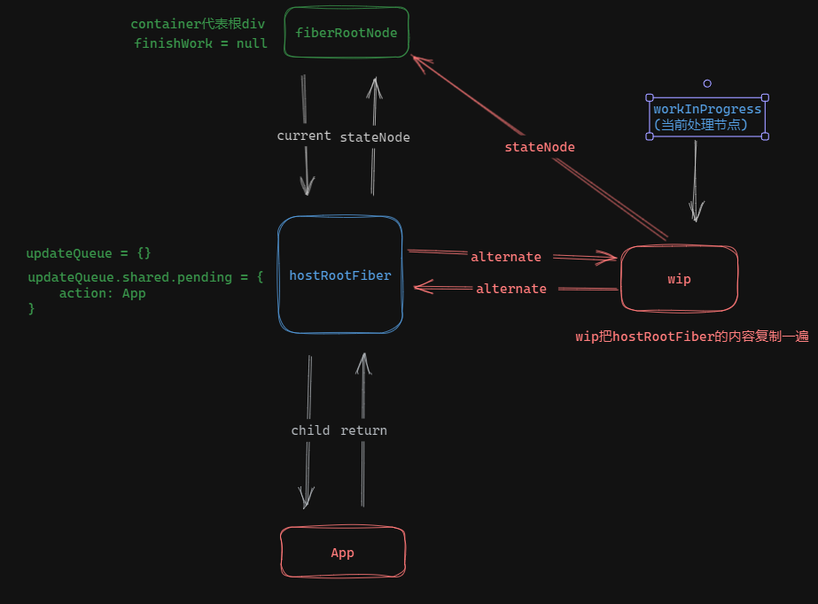

进入 createWorkInProgress 
```js
export const createWorkInProgress = (
        current: FiberNode,
        pendingProps: Props
): FiberNode => {
        let wip = current.alternate;

        // 初始化，挂载阶段
        if (wip === null) {
                // mount
                wip = new FiberNode(current.tag, pendingProps, current.key);
                wip.stateNode = current.stateNode;

                wip.alternate = current;
                current.alternate = wip;
        } else {
                // update
                wip.pendingProps = pendingProps;
                wip.flags = NoFlags;
                wip.subtreeFlags = NoFlags;
        }
        wip.type = current.type;
        wip.updateQueue = current.updateQueue;
        wip.child = current.child;
        wip.memoizedProps = current.memoizedProps;
        wip.memoizedState = current.memoizedState;

        return wip;
};
```

实际上这一段，就是保证workloop能成功执行
```js
        do {
                try {
                        workLoop();
                        break;
                } catch (e) {
                                console.warn('workLoop发生错误', e);

                        workInProgress = null;
                }
        } while (true);
```
进入wookloop
```js
function workLoop() {
        while (workInProgress !== null) {
                performUnitOfWork(workInProgress);
        }
}

```
执行 performUnitOfWork(workInProgress)
```js
function performUnitOfWork(fiber: FiberNode) {
        // 代表子节点
        // 递
        const next = beginWork(fiber);
        fiber.memoizedProps = fiber.pendingProps;

        if (next === null) {
                // fiber代表父
                // 归
                completeUnitOfWork(fiber);
        } else {
                workInProgress = next;
        }
}
```

### beginWork
递主要工作：
+ 建立节点的父子以及兄弟节点关联关系
  + Child return sibling
+ 给fiber节点打上flags标记

进入beginWork
```js
export const beginWork = (wip: FiberNode) => {
        // 比较，返回子fiberNode
        switch (wip.tag) {
                case HostRoot:
                        return updateHostRoot(wip);
                case HostComponent:
                        return updateHostComponent(wip);
                case HostText:
                        return null;
                case FunctionComponent:
                        return updateFunctionComponent(wip);
                default:
                        console.warn('beginWork未实现的类型');
                        break;
        }
        return null;
};
```

updateHostRoot

```js
function updateHostRoot(wip: FiberNode) {
        const baseState = wip.memoizedState;
        const updateQueue = wip.updateQueue as UpdateQueue<Element>;
        const pending = updateQueue.shared.pending;
        
        // 把wip上的updateQueue 给清空掉
        updateQueue.shared.pending = null;
        const { memoizedState } = processUpdateQueue(baseState, pending);
        wip.memoizedState = memoizedState;

        const nextChildren = wip.memoizedState;
        
        // 给wip构造子节点
        reconcileChildren(wip, nextChildren);
        return wip.child;
}
```

执行App函数获取app对应的element对象
```js
export const processUpdateQueue = <State>(
        baseState: State,
        pendingUpdate: Update<State> | null
): { memoizedState: State } => {
        const result: ReturnType<typeof processUpdateQueue<State>> = {
                memoizedState: baseState
        };

        if (pendingUpdate !== null) {
                const action = pendingUpdate.action;
                if (action instanceof Function) {
                        // baseState 1 update (x) => 4x -> memoizedState 4
                        // 这里就做到了把 function App执行
                        result.memoizedState = action(baseState);
                } else {
                        // baseState 1 update 2 -> memoizedState 2
                        result.memoizedState = action;
                }
        }

        return result;
};
```

const { memoizedState } = processUpdateQueue(baseState, pending);
进入processUpdateQueue， 创建 memoizedState，就是App对应element对象

此时我们的内存模型
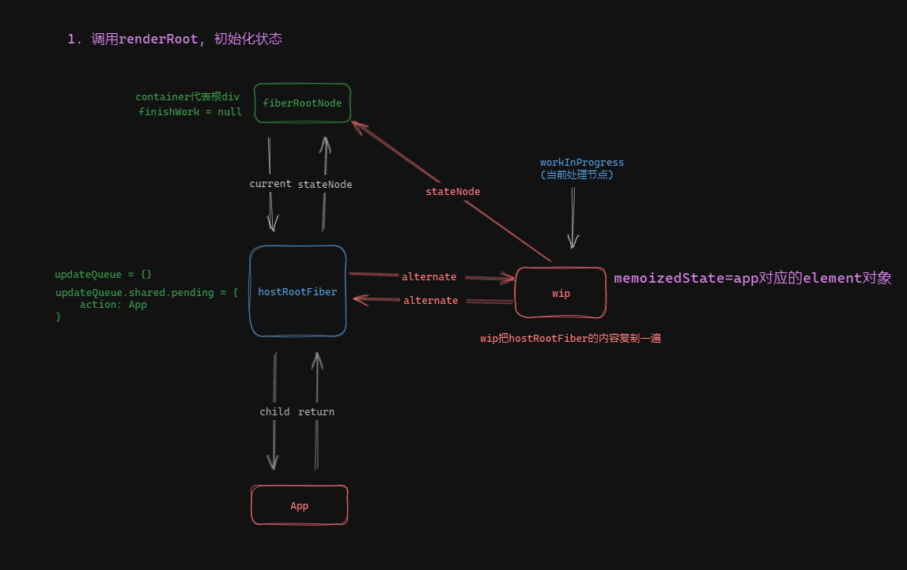

进入 reconcileChildren，reconcileChildren(wip, nextChildren);
```js
function reconcileChildren(wip: FiberNode, children?: ReactElementType) {
        const current = wip.alternate;

        if (current !== null) {
                // update
                // wip代表父亲节点，用child指向自己的子节点
                // current?.child是现有的child
                // children是传入的新child
                wip.child = reconcileChildFibers(wip, current?.child, children);
        } else {
                // mount
                wip.child = mountChildFibers(wip, null, children);
        }
}
```
进入reconcileChildFibers

reconcileChildFibers 和 mountChildFibers的逻辑是一样的，只是shouldTrackEffects的参数不一样，返回了一个新的函数。
```js
// 把element创建为子节点，通过return属性和父fiber挂钩
function ChildReconciler(shouldTrackEffects: boolean) {
    function reconcileSingleElement(
        returnFiber: FiberNode,
        currentFiber: FiberNode | null,
        element: ReactElementType
    ) {
        // 根据element创建fiber
        const fiber = createFiberFromElement(element);
        fiber.return = returnFiber;
        return fiber;
    }

    function reconcileSingleTextNode(
        returnFiber: FiberNode,
        currentFiber: FiberNode | null,
        content: string | number
    ) {
        const fiber = new FiberNode(HostText, { content }, null);
        fiber.return = returnFiber;
        return fiber;
    }

    function placeSingleChild(fiber: FiberNode) {
        // 如果是空节点，而且shouldTrackEffects 为true，代表挂载流程
        if (shouldTrackEffects && fiber.alternate === null) {
            fiber.flags |= Placement;
        }
        return fiber;
    }

    // 父级fiber  子fiber childElement
    return function reconcileChildFibers(
        returnFiber: FiberNode,   // 父节点
        currentFiber: FiberNode | null,   // 老的子节点
        newChild?: ReactElementType   // 新子节点
    ) {
        // 判断当前fiber的类型
        if (typeof newChild === 'object' && newChild !== null) {
            switch (newChild.$$typeof) {
                case REACT_ELEMENT_TYPE:
                    return placeSingleChild(
                        reconcileSingleElement(returnFiber, currentFiber, newChild)
                    );
                default:
                    console.warn('未实现的reconcile类型', newChild);
                    break;
            }
        }
        // TODO 多节点的情况 ul> li*3

        // HostText
        if (typeof newChild === 'string' || typeof newChild === 'number') {
            return placeSingleChild(
                reconcileSingleTextNode(returnFiber, currentFiber, newChild)
            );
        }

        console.warn('未实现的reconcile类型', newChild);

        return null;
    };
}

export const reconcileChildFibers = ChildReconciler(true);
export const mountChildFibers = ChildReconciler(false);

```

进入reconcileSingleElement
```js
function reconcileSingleElement(
    returnFiber: FiberNode,
    currentFiber: FiberNode | null,
    element: ReactElementType
) {
    // 根据element创建fiber
    // 在这里给子节点挂的return 和父fiber进行关联的
    const fiber = createFiberFromElement(element);
    fiber.return = returnFiber;

    // 返回的是新子元素创建的fiber对象
    return fiber;
}
```

进入placeSingleChild
```js
    function placeSingleChild(fiber: FiberNode) {

        // 如果老的节点没有，则标记为要更新
        if (shouldTrackEffects && fiber.alternate === null) {
            fiber.flags |= Placement;
        }
        return fiber;
    }
```

回到updateHostRoot 返回值  新的子节点fiber
```
function updateHostRoot(wip: FiberNode) {
        const baseState = wip.memoizedState;
        const updateQueue = wip.updateQueue as UpdateQueue<Element>;
        const pending = updateQueue.shared.pending;
        updateQueue.shared.pending = null;
        const { memoizedState } = processUpdateQueue(baseState, pending);
        wip.memoizedState = memoizedState;

        const nextChildren = wip.memoizedState;
        reconcileChildren(wip, nextChildren);
        return wip.child;
}
```
beginWork执行完毕，将next赋值为子节点
```js
function performUnitOfWork(fiber: FiberNode) {
        const next = beginWork(fiber);
        
        // 更新 父节点的props
        fiber.memoizedProps = fiber.pendingProps;

        if (next === null) {
                // fiber代表父
                completeUnitOfWork(fiber);
        } else {
                workInProgress = next;
        }
}
```
此时内存状态， wip和h1对应的fiber对象建立联系，并且给h1 fiber打上flags标记
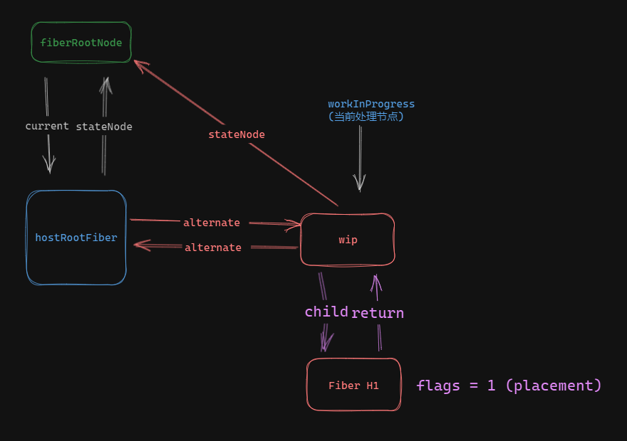

再次进入workloop
```js
function workLoop() {
        while (workInProgress !== null) {
                performUnitOfWork(workInProgress);
        }
}
```

以此类推，
beginWork不断的返回子节点，直到最下面的元素位置
### completeWork 

complateWork主要是做做了这些事
+ 创建真实的dom节点，但是还没渲染到页面中
+ 处理flags，合并位subTreeFlags
+ 建立真实dom的关系，把子dom插入到父dom中

进入completeWork
```js
function completeUnitOfWork(fiber: FiberNode) {
        let node: FiberNode | null = fiber;

        do {
                completeWork(node);
                const sibling = node.sibling;

                if (sibling !== null) {
                        workInProgress = sibling;
                        return;
                }
                node = node.return;
                workInProgress = node;
        } while (node !== null);
}
```

appendAllChildren parent代表当前的dom结构， wip代表当前结构对应的fiber对象
找到wip.child对应的 fiber对象，读取它的stateNode属性，找到子节点对应的dom节点

```js
function appendAllChildren(parent: Container, wip: FiberNode) {
        let node = wip.child;

        while (node !== null) {
                if (node.tag === HostComponent || node.tag === HostText) {
                        // 子节点的dom插入到父节点的dom中
                        appendInitialChild(parent, node?.stateNode);
                } else if (node.child !== null) {
                        node.child.return = node;
                        node = node.child;
                        continue;
                }

                if (node === wip) {
                        return;
                }

                while (node.sibling === null) {
                        if (node.return === null || node.return === wip) {
                                return;
                        }
                        node = node?.return;
                }
                node.sibling.return = node.return;
                node = node.sibling;
        }
}
```

appendInitialChild 把子dom插入到父级dom元素中
```js
export const appendInitialChild = (
        parent: Instance | Container,
        child: Instance
) => {
        parent.appendChild(child);
};
```

进入commitRoot流程，这是同步提交更新dom流程。
获取finishedWork，然后把root.finishedWork 置空
```
function commitRoot(root: FiberRootNode) {
        const finishedWork = root.finishedWork;

        if (finishedWork === null) {
                return;
        }
                console.warn('commit阶段开始', finishedWork);
        // 重置
        root.finishedWork = null;

        // 判断是否存在3个子阶段需要执行的操作
        // root flags root subtreeFlags
        const subtreeHasEffect =
                (finishedWork.subtreeFlags & MutationMask) !== NoFlags;
        const rootHasEffect = (finishedWork.flags & MutationMask) !== NoFlags;

        if (subtreeHasEffect || rootHasEffect) {
                // beforeMutation
                // mutation Placement
                commitMutationEffects(finishedWork);

                root.current = finishedWork;

                // layout
        } else {
                root.current = finishedWork;
        }
}
```

flags和subtreeFlags 的区别？
我自己要 删除   flags = 删除
子元素要     改   新增 
subtreeFlags = 改 增 
flags代表自己
subtreeFlags 代表子元素的集合

递和归已经结束，内存状态如下
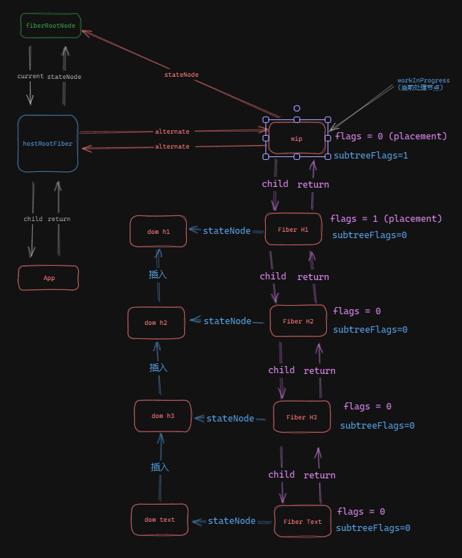

### commit
1. 进入commit阶段， 真实的dom渲染
```js
function renderRoot(root: FiberRootNode) {
        // 初始化
        // 初始化wip
        prepareFreshStack(root);

        do {
                try {
                        workLoop();
                        break;
                } catch (e) {
                                console.warn('workLoop发生错误', e);

                        workInProgress = null;
                }
        } while (true);

        const finishedWork = root.current.alternate;
        root.finishedWork = finishedWork;

        // wip fiberNode树 树中的flags
        commitRoot(root);
}
```

最后都会走进commitMutationEffects 这个方法
```js
function commitRoot(root: FiberRootNode) {
        const finishedWork = root.finishedWork;

        if (finishedWork === null) {
                return;
        }
                console.warn('commit阶段开始', finishedWork);
        // 重置
        root.finishedWork = null;

        // 判断是否存在3个子阶段需要执行的操作
        // root flags root subtreeFlags
        const subtreeHasEffect =
                (finishedWork.subtreeFlags & MutationMask) !== NoFlags;
        const rootHasEffect = (finishedWork.flags & MutationMask) !== NoFlags;

        if (subtreeHasEffect || rootHasEffect) {
                // beforeMutation
                // mutation Placement
                commitMutationEffects(finishedWork);

                root.current = finishedWork;

                // layout
        } else {
                root.current = finishedWork;
        }
}
```

commitMutaitonEffectsOnFiber 

```
const commitMutaitonEffectsOnFiber = (finishedWork: FiberNode) => {
    const flags = finishedWork.flags;

    if ((flags & Placement) !== NoFlags) {
        commitPlacement(finishedWork);
        finishedWork.flags &= ~Placement;
    }
    // flags Update
    // flags ChildDeletion
};
```
当h1真正插入到页面中
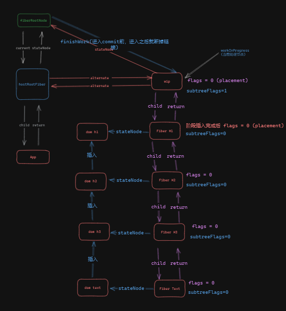

当执行完 commitMutationEffects，讲dom渲染到页面中之后。
root.current = finishedWork 断开和老节点之间的联系
```
function commitRoot(root: FiberRootNode) {
    const finishedWork = root.finishedWork;

    if (finishedWork === null) {
        return;
    }
        console.warn('commit阶段开始', finishedWork);
    // 重置
    root.finishedWork = null;

    // 判断是否存在3个子阶段需要执行的操作
    // root flags root subtreeFlags
    const subtreeHasEffect =
        (finishedWork.subtreeFlags & MutationMask) !== NoFlags;
    const rootHasEffect = (finishedWork.flags & MutationMask) !== NoFlags;

    if (subtreeHasEffect || rootHasEffect) {
        // beforeMutation
        // mutation Placement
        commitMutationEffects(finishedWork);

        root.current = finishedWork;

        // layout
    } else {
        root.current = finishedWork;
    }
}
```

此时内存模型如下

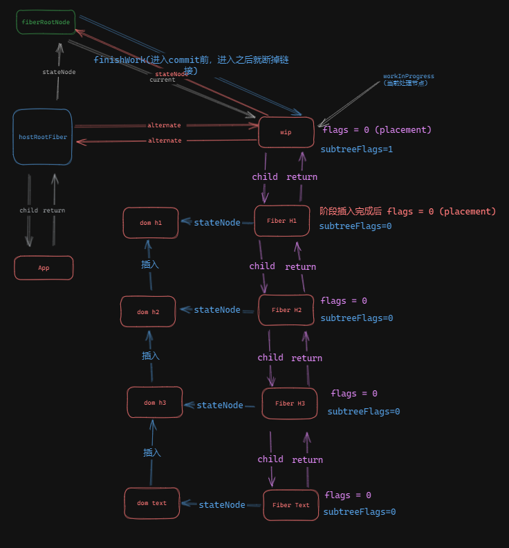

## 实现函数式组件Hooks渲染流程

```js
// @ts-nocheck

import { jsx } from './react/jsx'
import { ReactElementType } from '@/shared/ReactTypes';
// const App = jsx("div", {
//     children: jsx("span", {
//       id: "xxx",
//       children: "ssss"
//     })
// })
import { useState } from '@/react';
function App() {
    const [num, setNum] = useState(3);
    window.setNum = setNum;
    return num === 3 ? <Child onClick={() => setNum(111)} /> : <div>{num}</div>;
}

function Child() {
    return <span>九剑react</span>;
}
import ReactDom from '@/react-dom'
const root: any = document.querySelector('#root')

debugger
ReactDom.createRoot(root).render(<App />)
```

当进入App fiber对象的“递”阶段处理时
```js
function updateFunctionComponent(wip: FiberNode) {
        const nextChildren = renderWithHooks(wip);
        reconcileChildren(wip, nextChildren);
        return wip.child;
}
```
新增两个全局变量
```js
// 当前在处理哪个函数式组件
let currentlyRenderingFiber: FiberNode | null = null;

let workInProgressHook: Hook | null = null;

// 当前在处理哪个hooks
let currentHook: Hook | null = null;
```

函数组件实际上在"递"的时候，是执行的这个方法

```js
export function renderWithHooks(wip: FiberNode) {
        // 赋值操作
        currentlyRenderingFiber = wip;
        // 重置 hooks链表
        wip.memoizedState = null;

        const current = wip.alternate;

        if (current !== null) {
                // update
                currentDispatcher.current = HooksDispatcherOnUpdate;
        } else {
                // mount
                currentDispatcher.current = HooksDispatcherOnMount;
        }

        const Component = wip.type;
        const props = wip.pendingProps;
        // FC render
        const children = Component(props);

        // 重置操作
        currentlyRenderingFiber = null;
        workInProgressHook = null;
        currentHook = null;
        return children;
}
```

useState更新和挂载分别走以下两种
```js
const HooksDispatcherOnMount: Dispatcher = {
    useState: mountState
};

const HooksDispatcherOnUpdate: Dispatcher = {
    useState: updateState
};
```
初始化挂载，调用mountState
```js
function mountState<State>(
        initialState: (() => State) | State
): [State, Dispatch<State>] {
        // 找到当前useState对应的hook数据
        const hook = mountWorkInProgresHook();
        let memoizedState;
        if (initialState instanceof Function) {
                memoizedState = initialState();
        } else {
                memoizedState = initialState;
        }
        const queue = createUpdateQueue<State>();
        hook.updateQueue = queue;
        hook.memoizedState = memoizedState;

        // @ts-ignore
        const dispatch = dispatchSetState.bind(null, currentlyRenderingFiber, queue);
        queue.dispatch = dispatch;
        return [memoizedState, dispatch];
}
```

```js
function mountWorkInProgresHook(): Hook {
        const hook: Hook = {
                memoizedState: null,
                updateQueue: null,
                next: null
        };
        if (workInProgressHook === null) {
                // mount时 第一个hook
                
                // 在函数式组件中调用hook，怎么保证一定在函数内部调用的hook
                if (currentlyRenderingFiber === null) {
                        throw new Error('请在函数组件内调用hook');
                } else {
                        workInProgressHook = hook;
                        currentlyRenderingFiber.memoizedState = workInProgressHook;
                }
        } else {
                // mount时 后续的hook
                workInProgressHook.next = hook;
                workInProgressHook = hook;
        }
        return workInProgressHook;
}
```
App此时的Hooks执行状态
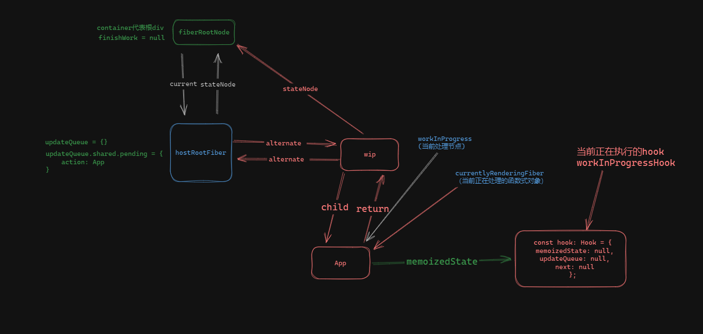
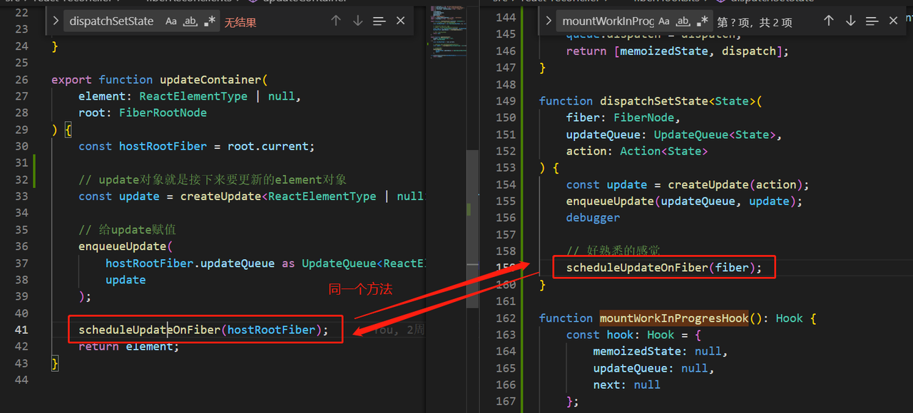

当APP函数执行完

```js
export function renderWithHooks(wip: FiberNode) {
        // 赋值操作
        currentlyRenderingFiber = wip;
        // 重置 hooks链表
        wip.memoizedState = null;

        const current = wip.alternate;

        if (current !== null) {
                // update
                currentDispatcher.current = HooksDispatcherOnUpdate;
        } else {
                // mount
                currentDispatcher.current = HooksDispatcherOnMount;
        }

        const Component = wip.type;
        const props = wip.pendingProps;
        // FC render
        const children = Component(props);

        // 重置操作
        currentlyRenderingFiber = null;
        workInProgressHook = null;
        currentHook = null;
        return children;
}
```

## 合成事件
React为什么要设计合成事件
+ 统一各个浏览器的表现
+ React支持的不仅有浏览器，还有React  Native等，为了对事件进行统一
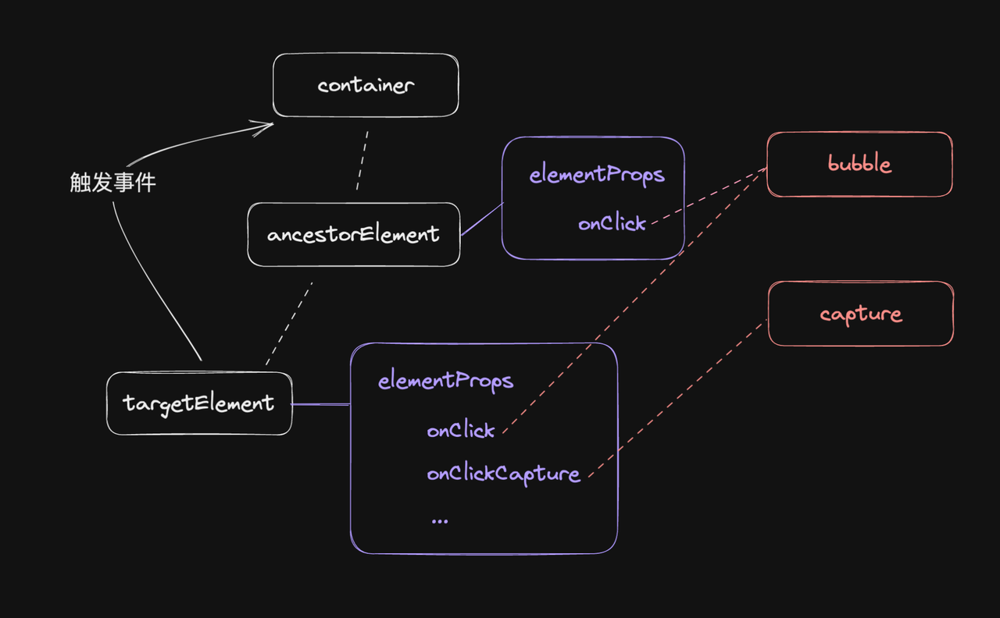
事件初始化的过程
```js
export function initEvent(container: Container, eventType: string) {
    if (!validEventTypeList.includes(eventType)) {
        console.warn('当前不支持', eventType, '事件');
        return;
    }
    console.log('初始化事件：', eventType);

    // debugger

    // 在react中事件都绑定在  rect的容器根节点
    container.addEventListener(eventType, (e) => {
        dispatchEvent(container, eventType, e);
    });
}
```
## 兄弟节点的处理
react的遍历是深度优先遍历   DFS
自己下去跑断点

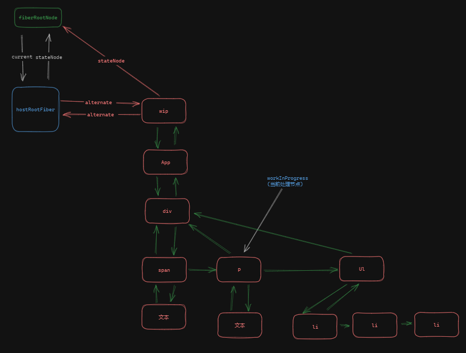

## Diff

比较元素的三大原则
+ 我希望你，更新前后，层级一致
+ 更新前后，类型一致
+ 更新前后 key相同

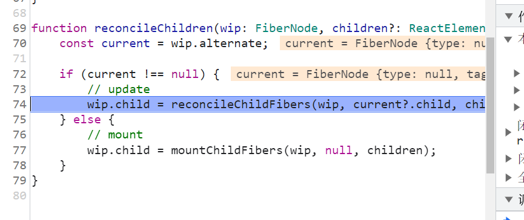

wip的alternate只要存在走的就是更新流程
```js
老 one two three (1 2 3)
          index   0 1 2

旧 two three one (2 3 1)
          index   0 1 2
  对应的老的index  1 2 0
  
  
  diff算法的过程
  此时渲染 two  记录oldindex = 1
                   lastPlacedIndex = 0  (最后可复用的新节点的oldIndex)
                  
  准备渲染 three lastPlacedIndex  = 1
                oldindex = 2
  
  准备渲染 one   lastPlacedIndex = 2
                oldindex = 0
```

Snipaste_2023-09-18_17-55-00.jpg

## 批处理
实际上只渲染了一次
```js
function App() {
    // const [num, setNum] = useState(100);
    const [count, setCount] = useState(0)

    function handle_click() {
        debugger
        setCount((count) => {
            return count + 1
        })
        setCount((count) => {
            return count + 1
        })
        setCount((count) => {
            return count + 1
        })
        debugger
    }

    // a => a
    return (
        <div >
            <h1 onClick={handle_click}>点我新增</h1>
            <h2>{count}</h2>
        </div>
    );  
}
```
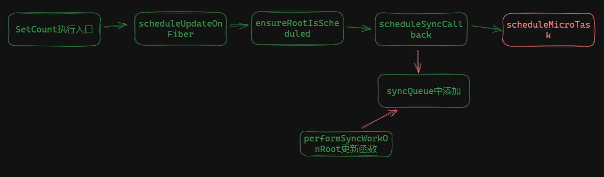
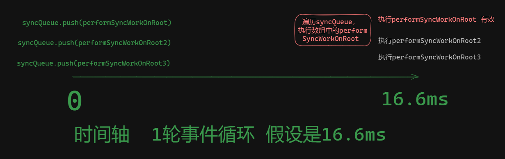

总结：
在react中同步渲染模式下，render也是异步执行的，在微任务中

## React更新队列是双端环状链表
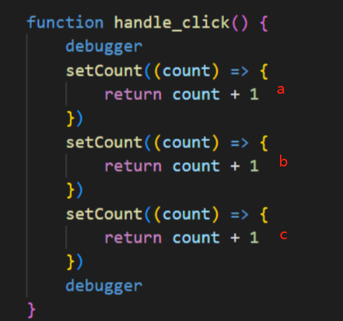
a => b => c => a  双端环状链表

为什么这么设计，方便遍历

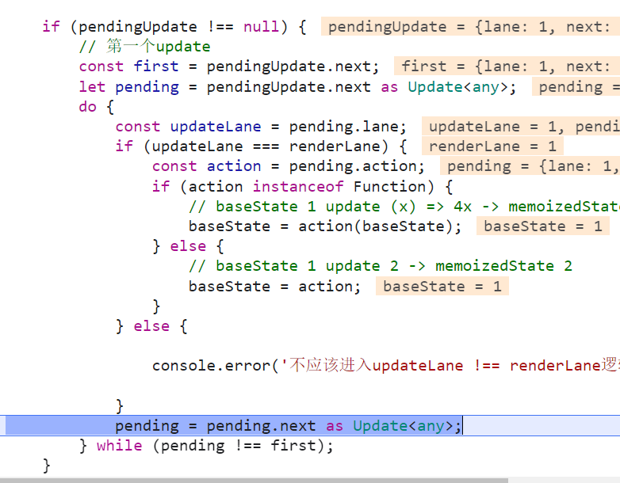

## useEffect的执行过程
```js
// @ts-nocheck

import { jsx } from './react/jsx'
import { ReactElementType } from '@/shared/ReactTypes';
// const App = jsx("div", {
//     children: jsx("span", {
//       id: "xxx",
//       children: "ssss"
//     })
// })
import { useState, useEffect } from '@/react';

function effect1() {
    console.log('useEffect回调111执行')

    return () => {
        console.log('effect1111 销毁')
    }
}

function effect2() {
    console.log('useEffect回调2222执行')

    return () => {
        console.log('effect222 销毁')
    }
}

function effect3() {
    console.log('useEffect回调333执行')

    return () => {
        console.log('effect3333 销毁')
    }
}

function effect4() {
    console.log('useEffect回调4444执行')

    return () => {
        console.log('effect444 销毁')
    }
}

function Bpp() {

    useEffect(effect3)

    useEffect(effect4)

    return (
        <h1>Bpp</h1>
    )
}

function App() {
    const [count, setCount] = useState(0)

    useEffect(effect1)

    useEffect(effect2)

    function handle_click() {
        setCount((count) => {
            return count + 1
        })
    }

    // a => a
    return (
        <div >
            <h1 onClick={handle_click}>点我新增111</h1>
            <Bpp />
            {/* <h2>{count}</h2> */}
        </div>
    );  
}

import ReactDom from '@/react-dom'
const root: any = document.querySelector('#root')

// debugger
ReactDom.createRoot(root).render(<App />)

```

拿App举例

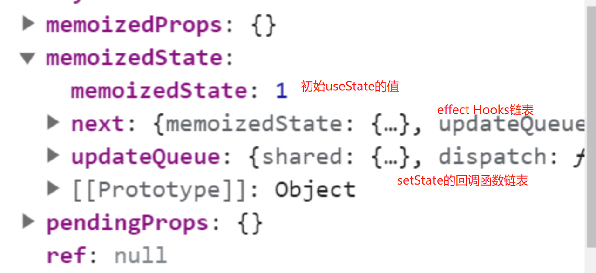
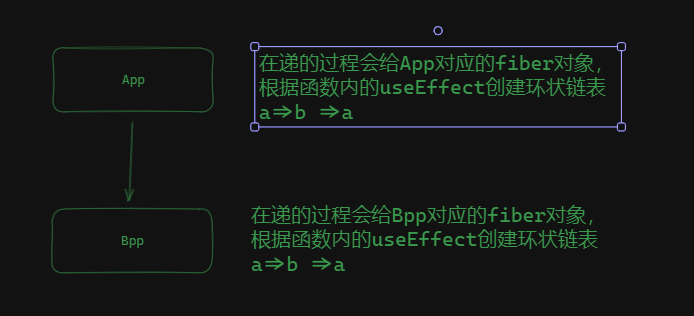

useEffect回调的执行过程
执行阶段： commit （真实dom的修改同步执行，页面的更新）
执行时机： commit的前面， 但是通过宏任务异步执行的。

在commit的归阶段，会先进入Bpp，判断flags === 8

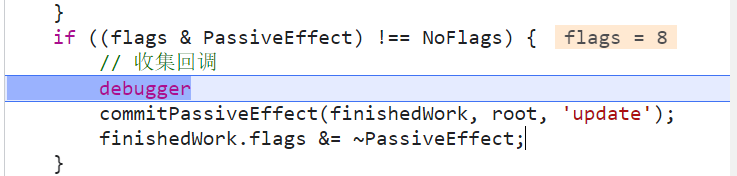

处理到BPP的时候，会给根节点的 pendingPassiveEffect中的updata数组，push自己对应的环状Effect链表

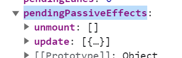
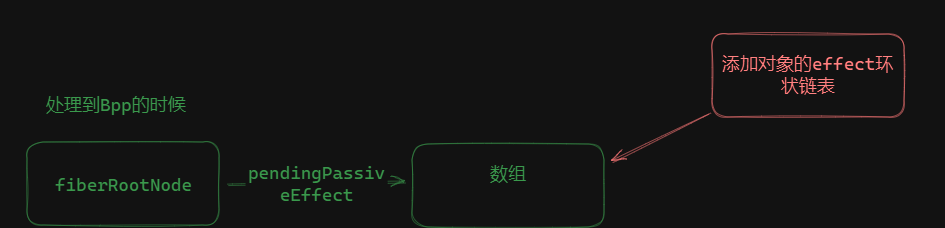

处理完App后

## React并发更新
可中断渲染的概念
高优先级的任务可以打断低优先级的任务，在低优先级任务执行过程中，如果此时插入了高优先级的任务，高优先会优先处理。
React独一无二。
演示并发效果
https://codesandbox.io/s/concurrent-3h48s?file=/src/index.js

### 相同优先级的调度
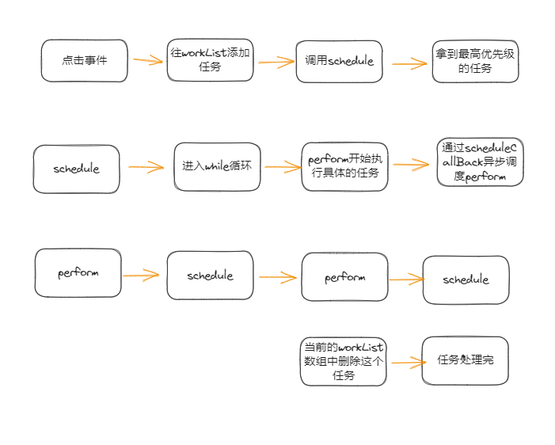
### 高优先级打断低优先级
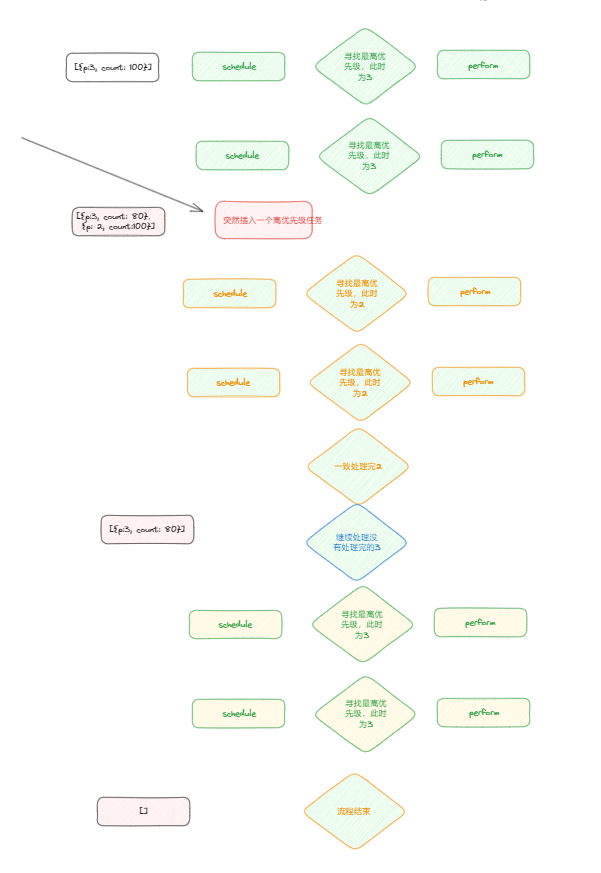