# 优先级排序算法（最小堆）

## 堆排序
### 定义 
堆必须是一个完全二叉树
> 完全二叉树
+ 完全二叉树只允许最后一行不为满
+ 且最后一行必须从左到右排序
+ 最后一行元素之间不可以有间隔

> 下面的图都是完全二叉树
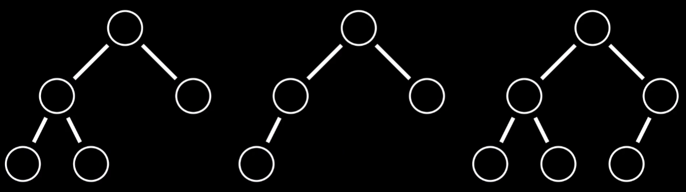

> 下面的图都不是完全二叉树
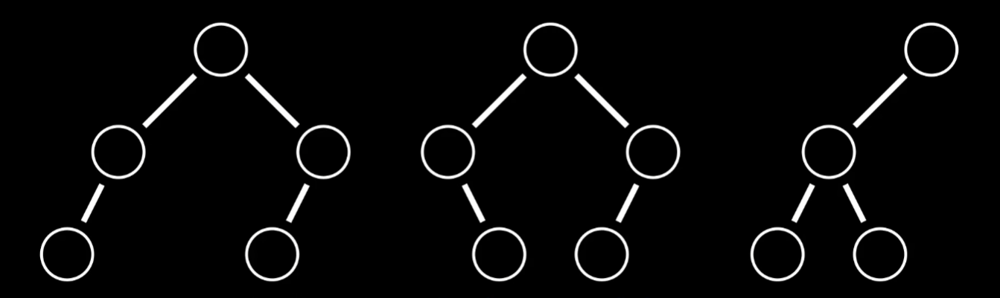

#### 堆序性
堆可以分为大根堆和小根堆
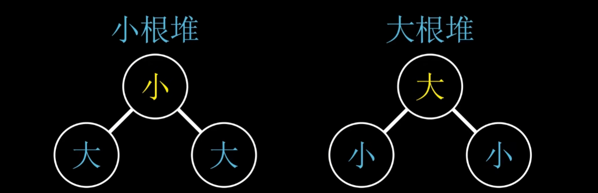

##### 大根堆
在大根堆中,每一个父节点元素都大于他的子节点元素

> 下面的图是合法的大根堆
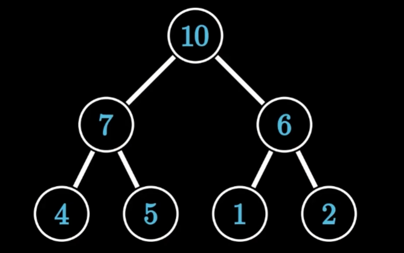

##### 小根堆
在小根堆中,每一个父节点元素都小于他的子节点元素

> 下面的图是合法的小根堆
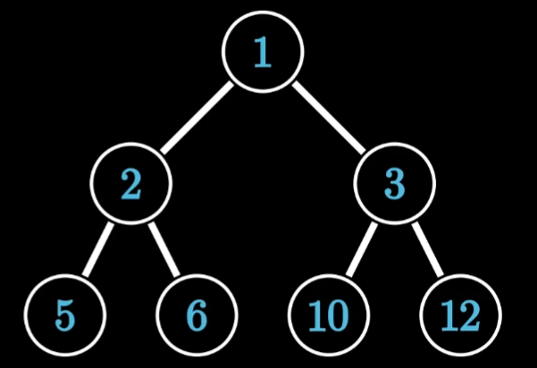

#### 堆存储
按照层序遍历的顺序来给节点编号,也就是从上到下,从左到右.然后把这些编号对应到数组的下标,然后把树的元素存入到响应的下标里,因为堆是完全二叉树,所以下标和每一个树的位置是一一对应的。这样堆就可以用数组来描述
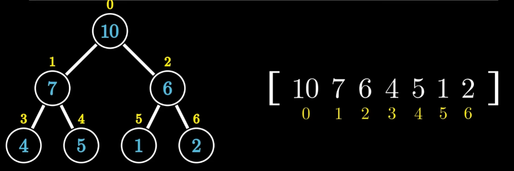
我们可以通过上述规则得出如下规律
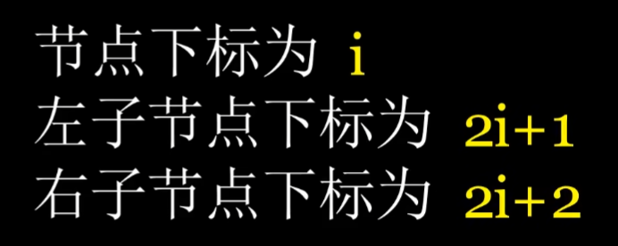

### 基本操作
堆有两个基本操作，分别是上滤和下滤，运用这两个基本操作基本能实现堆的所有功能
#### 下滤
> 
+ 当前1号节点不满足大顶堆排序,然后对比当前与最大子节点，即对比1和7两个节点，如果1<7则交换两节点
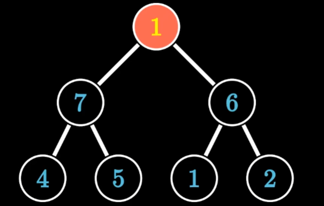
+ 交换之后继续比较，我们发现当前节点1和最大子节点5比较时候，1<5,则交换两节点
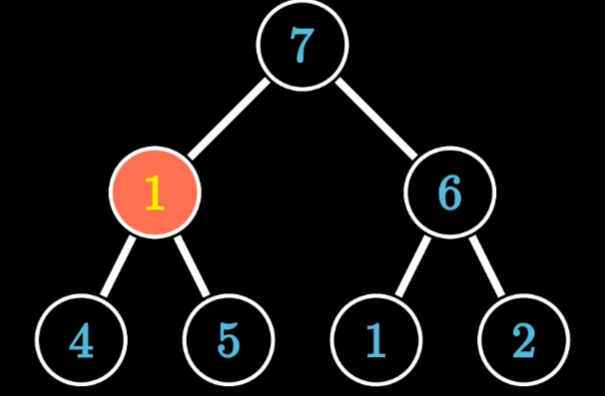
+ 交换完成之后一直交换，满足父节点比子节点大为止，或者是堆最底部为止
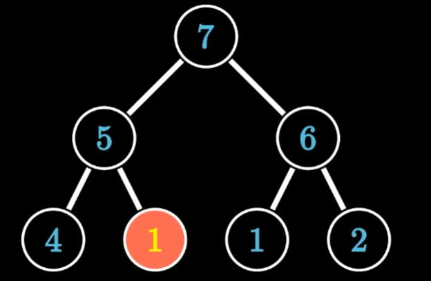

#### 上滤
> 
+ 当前8号节点不满足大顶堆排序,然后对比当前与最大父节点，即对比8和6两个节点，如果8>6则交换两节点
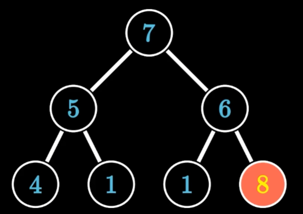
+ 交换之后继续比较，我们发现当前节点8和最大父节点7比较时候，8>7,则交换两节点
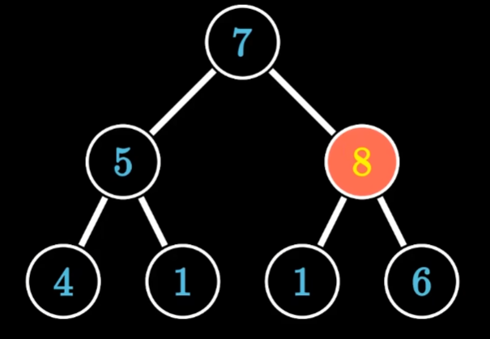
+ 交换完成之后一直交换，满足父节点比子节点大为止，或者是堆最顶部为止
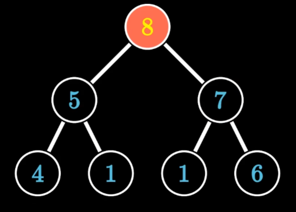

### 建堆 
建堆方式可以分为自顶向下，自下而上法


#### 自顶向下
即每次插入数据将它放在堆的第一位，然后对其进行下滤操作
#### 自下向上
即每次插入数据将它放在堆的最后一位，然后对其进行上滤操作
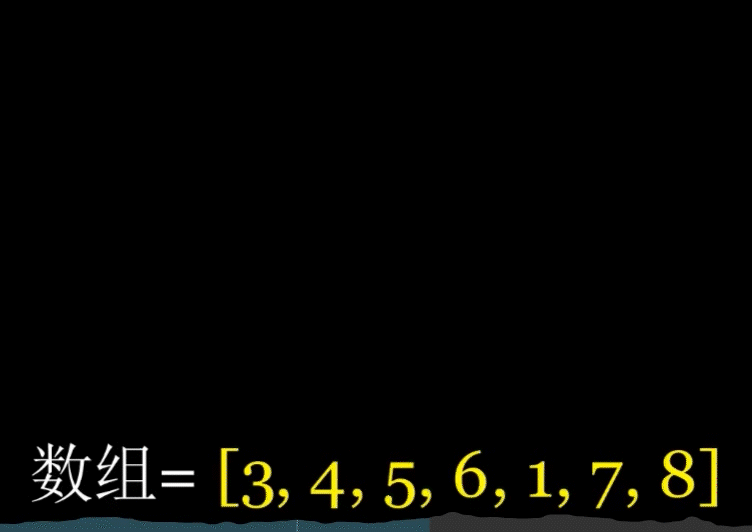

### 堆排序
只需要将优先队列中的对顶元素依次弹出即可，在弹出后，将最后一个元素补上堆顶，然后依次进行下滤操作，这样就可以完成一个堆的排序功能
+ 最小堆弹出后的队列升序
+ 大顶堆弹出后的队列降序

### 优先队列
优先队列是一种抽象数据类型，它的主要特点是可以高效地在集合中插入元素和删除最小（或最大）元素。在计算机科学中，堆（也称作二叉堆）是一种实现优先队列的数据结构。有两种类型的堆：最大堆和最小堆。最大堆的每个父节点都比其子节点大，而最小堆则相反。

> 堆的主要操作有
+ 插入O(log n)：在堆中插入一个新元素，并保持堆属性
+ 获取最大/最小值O(1)：找到堆中的最大元素（最大堆）或最小元素（最小堆），但不删除
+ 提取最大/最小值O(log n)：删除并返回堆中的最大元素（最大堆）或最小元素（最小堆），同时保持堆属性
+ 增加/降低键值O(log n)：更改堆中某个元素的值，并维护堆属性

## React源码中的最小堆
```js
  function push(heap, node) {
    var index = heap.length;
    heap.push(node);
    siftUp(heap, node, index);
  }
  function peek(heap) {
    return heap.length === 0 ? null : heap[0];
  }
  function pop(heap) {
    if (heap.length === 0) {
      return null;
    }

    var first = heap[0];
    var last = heap.pop();

    if (last !== first) {
      heap[0] = last;
      siftDown(heap, last, 0);
    }

    return first;
  }

  function siftUp(heap, node, i) {
    var index = i;

    while (index > 0) {
      var parentIndex = index - 1 >>> 1;
      var parent = heap[parentIndex];

      if (compare(parent, node) > 0) {
        // The parent is larger. Swap positions.
        heap[parentIndex] = node;
        heap[index] = parent;
        index = parentIndex;
      } else {
        // The parent is smaller. Exit.
        return;
      }
    }
  }

  function siftDown(heap, node, i) {
    var index = i;
    var length = heap.length;
    var halfLength = length >>> 1;

    while (index < halfLength) {
      var leftIndex = (index + 1) * 2 - 1;
      var left = heap[leftIndex];
      var rightIndex = leftIndex + 1;
      var right = heap[rightIndex]; // If the left or right node is smaller, swap with the smaller of those.

      if (compare(left, node) < 0) {
        if (rightIndex < length && compare(right, left) < 0) {
          heap[index] = right;
          heap[rightIndex] = node;
          index = rightIndex;
        } else {
          heap[index] = left;
          heap[leftIndex] = node;
          index = leftIndex;
        }
      } else if (rightIndex < length && compare(right, node) < 0) {
        heap[index] = right;
        heap[rightIndex] = node;
        index = rightIndex;
      } else {
        // Neither child is smaller. Exit.
        return;
      }
    }
  }

  function compare(a, b) {
    // Compare sort index first, then task id.
    var diff = a.sortIndex - b.sortIndex;
    return diff !== 0 ? diff : a.id - b.id;
  }
```